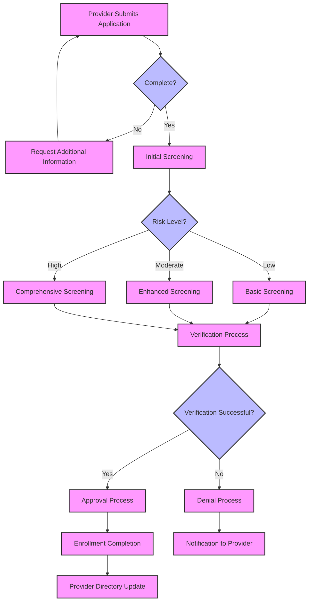
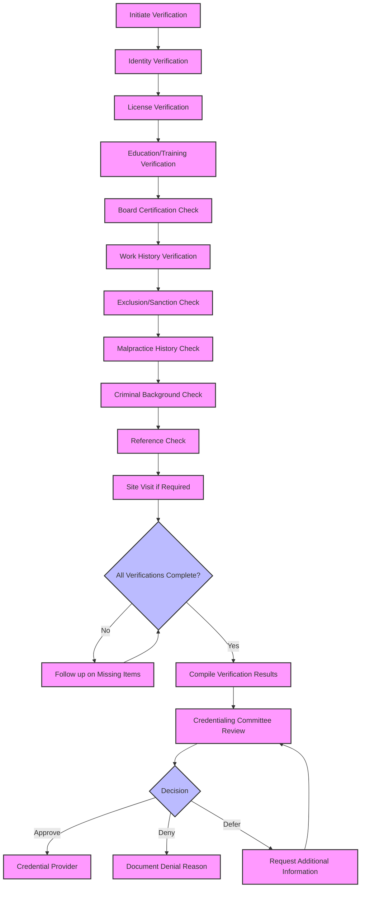
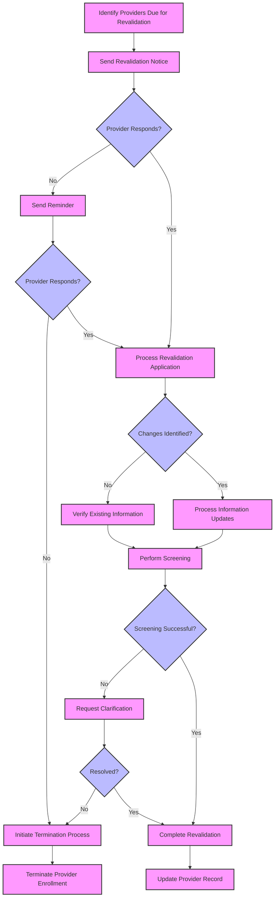

<i><b>NOTE: This information is based on MITA 3.0, which can be leveraged and updated for MITA 4.0</b></i>

This section provides guidance for implementing Medicaid provider credentialing and enrollment systems in alignment with MITA 3.0 principles and this FHIR Implementation Guide.

### MITA 3.0 Implementation Principles

1. **Modular Architecture**
- Implement loosely coupled services that can be independently deployed and scaled
- Use microservices architecture patterns where appropriate
- Ensure each module has well-defined interfaces and responsibilities

2. **API-First Design**
- Design RESTful APIs before implementing user interfaces
- Follow FHIR R4 specifications for healthcare data exchange
- Implement comprehensive API documentation and testing

3. **Cloud-Native Approach**
- Design for cloud deployment from the beginning
- Use containerization technologies (Docker, Kubernetes)
- Implement auto-scaling and load balancing capabilities

4. **Data Standards Compliance**
- Adopt FHIR R4 as the primary data exchange standard
- Implement US Core profiles where applicable
- Use standardized code systems and value sets

### Implementation Phases

#### Phase 1: Foundation (Months 1-6)
- Establish development and deployment infrastructure
- Implement core FHIR server capabilities
- Develop basic provider and organization profiles
- Create initial API endpoints for CRUD operations

#### Phase 2: Core Functionality (Months 7-12)
- Implement provider enrollment workflows
- Add credentialing status tracking
- Develop verification and validation processes
- Create provider directory capabilities

#### Phase 3: Advanced Features (Months 13-18)
- Implement automated screening processes
- Add risk-based categorization
- Develop reporting and analytics capabilities
- Integrate with external verification sources

#### Phase 4: Optimization (Months 19-24)
- Implement machine learning for fraud detection
- Add predictive analytics capabilities
- Optimize performance and scalability
- Enhance user experience and automation

### Technical Architecture

#### System Components

##### FHIR Server
- Central repository for all provider-related data
- Implements FHIR R4 specification
- Supports RESTful API operations
- Provides search and query capabilities

#### Key Process Workflow Diagrams

##### Provider Enrollment Workflow



##### Credentialing Verification Workflow



##### Revalidation Workflow



##### Provider Enrollment Service
- Manages provider application processes
- Implements workflow orchestration
- Handles document management
- Provides status tracking

##### Credentialing Service
- Manages credentialing workflows
- Implements verification processes
- Tracks credentialing status
- Manages revalidation cycles

##### Verification Service
- Interfaces with external verification sources
- Implements primary source verification
- Manages verification results
- Provides audit trails

##### Provider Directory
- Maintains searchable provider directory
- Implements provider lookup capabilities
- Supports network adequacy reporting
- Provides public-facing search interface

#### Integration Patterns

##### Synchronous Integration
- Real-time API calls for immediate responses
- Used for provider lookups and status checks
- Implements timeout and retry mechanisms
- Provides immediate feedback to users

##### Asynchronous Integration
- Message-based integration for long-running processes
- Used for verification workflows and batch processing
- Implements event-driven architecture
- Provides eventual consistency guarantees

##### Batch Integration
- Scheduled data synchronization processes
- Used for reporting and analytics
- Implements incremental data loading
- Provides data quality validation

### Data Management

#### Data Quality Framework
- Implement data validation rules at API level
- Use FHIR validation capabilities
- Implement business rule validation
- Provide data quality metrics and reporting

### Implementation Patterns for Exclusions and Sanctions

#### Exclusion and Sanction Checking Pattern

This pattern provides a standardized approach for checking provider exclusions and sanctions across federal and state databases.

##### Resources Used
- `MedicaidPractitioner` - The provider being checked
- `MedicaidVerificationResult` - Results of exclusion/sanction checks
- `MedicaidPractitionerRole` - For updating enrollment status based on findings

##### Implementation Steps

1. **Configure Exclusion Sources**
   - Implement connections to required exclusion databases:
     - OIG List of Excluded Individuals/Entities (LEIE)
     - System for Award Management (SAM)
     - State Medicaid exclusion lists
     - State licensing board disciplinary actions
     - NPDB reports (if applicable)

2. **Implement Verification Process**
   ```fsh
   Profile: ExclusionSanctionCheck
   Parent: MedicaidVerificationResult
   Id: exclusion-sanction-check
   Title: "Exclusion and Sanction Check"
   Description: "Verification result for provider exclusion and sanction checks"
   * ^status = #active
   * extension contains
       checkTimestamp 1..1 and
       checkSource 1..* and
       matchStatus 1..1 and
       matchDetails 0..1
   * extension[checkTimestamp].value[x] only dateTime
   * extension[checkSource].value[x] only CodeableConcept
   * extension[checkSource].valueCodeableConcept from ExclusionSanctionSources (required)
   * extension[matchStatus].value[x] only code
   * extension[matchStatus].valueCode from #match | #no-match | #possible-match
   * extension[matchDetails].value[x] only string
   * status 1..1
   * target 1..1
   * target only Reference(MedicaidPractitioner or MedicaidOrganization)
   * validationType 1..1
   * validationType = http://terminology.hl7.org/CodeSystem/validation-type#primary "Primary Source"
   * validationProcess 1..*
   * validationProcess from ExclusionCheckMethods (required)
   * primarySource 1..*
   * primarySource.who 1..1
   * primarySource.validationStatus 1..1
   * primarySource.validationDate 1..1
   ```

3. **Implement Automated Checking**
   - Develop scheduled batch processes for checking all active providers
   - Implement real-time checks during enrollment and revalidation
   - Create APIs for on-demand verification

4. **Define Match Processing Logic**
   - Implement exact matching using NPI, SSN/TIN, and name
   - Develop fuzzy matching algorithms for name variations
   - Create process for manual review of potential matches
   - Document match confidence scoring methodology

5. **Implement Status Update Workflow**
   ```mermaid
   flowchart TD
       A[Exclusion Check Initiated] --> B{Match Found?}
       B -->|No Match| C[Document Clean Check]
       B -->|Potential Match| D[Manual Review]
       B -->|Exact Match| E[Automatic Suspension]
       D --> F{Confirmed Match?}
       F -->|No| C
       F -->|Yes| E
       E --> G[Update Provider Status]
       G --> H[Generate Notification]
       H --> I[Document Action]
       C --> J[Continue Normal Processing]
       
       classDef process fill:#f9f,stroke:#333,stroke-width:2px;
       classDef decision fill:#bbf,stroke:#333,stroke-width:2px;
       classDef endpoint fill:#bfb,stroke:#333,stroke-width:2px;
       
       class A,C,D,E,G,H,I,J process;
       class B,F decision;
   ```

6. **Implement Provider Status Updates**
   - Update `MedicaidPractitionerRole.extension:enrollmentStatus` to "suspended" when exclusion found
   - Create task for compliance officer review
   - Generate appropriate notifications
   - Document action in audit log

7. **Example Implementation**
   ```json
   {
     "resourceType": "MedicaidVerificationResult",
     "id": "exclusion-check-example",
     "meta": {
       "profile": [
         "http://hl7.org/fhir/us/medicaid-provider-credentialing/StructureDefinition/exclusion-sanction-check"
       ]
     },
     "extension": [
       {
         "url": "checkTimestamp",
         "valueDateTime": "2023-06-15T14:30:00Z"
       },
       {
         "url": "checkSource",
         "valueCodeableConcept": {
           "coding": [
             {
               "system": "http://hl7.org/fhir/us/medicaid-provider-credentialing/CodeSystem/exclusion-sanction-sources",
               "code": "leie",
               "display": "OIG List of Excluded Individuals/Entities"
             }
           ]
         }
       },
       {
         "url": "matchStatus",
         "valueCode": "match"
       },
       {
         "url": "matchDetails",
         "valueString": "Excluded for Medicare fraud on 2022-03-15, exclusion period 5 years"
       }
     ],
     "status": "validated",
     "target": [
       {
         "reference": "Practitioner/excluded-provider-example"
       }
     ],
     "validationType": {
       "coding": [
         {
           "system": "http://terminology.hl7.org/CodeSystem/validation-type",
           "code": "primary",
           "display": "Primary Source"
         }
       ]
     },
     "validationProcess": [
       {
         "coding": [
           {
             "system": "http://hl7.org/fhir/us/medicaid-provider-credentialing/CodeSystem/exclusion-check-methods",
             "code": "api-check",
             "display": "API Verification"
           }
         ]
       }
     ],
     "primarySource": [
       {
         "who": {
           "display": "Office of Inspector General"
         },
         "validationStatus": {
           "coding": [
             {
               "system": "http://hl7.org/fhir/us/medicaid-provider-credentialing/CodeSystem/medicaid-verification-status",
               "code": "verified",
               "display": "Verified"
             }
           ]
         },
         "validationDate": "2023-06-15"
       }
     ]
   }
   ```

#### Sanction Management Pattern

This pattern provides a standardized approach for managing provider sanctions imposed by the state Medicaid program.

##### Resources Used
- `MedicaidPractitioner` or `MedicaidOrganization` - The sanctioned provider
- `MedicaidPractitionerRole` - For managing enrollment status
- `MedicaidVerificationResult` - For documenting sanction verification
- `Task` - For managing sanction workflow
- `Communication` - For sanction notifications

##### Implementation Steps

1. **Define Sanction Types and Codes**
   ```fsh
   CodeSystem: MedicaidSanctionTypes
   Id: medicaid-sanction-types
   Title: "Medicaid Sanction Types"
   Description: "Types of sanctions that can be applied to Medicaid providers"
   * ^url = "http://hl7.org/fhir/us/medicaid-provider-credentialing/CodeSystem/medicaid-sanction-types"
   * ^status = #active
   * ^caseSensitive = true
   * ^content = #complete
   * #payment-suspension "Payment Suspension" "Suspension of Medicaid payments"
   * #enrollment-suspension "Enrollment Suspension" "Temporary suspension of enrollment"
   * #enrollment-termination "Enrollment Termination" "Termination of enrollment"
   * #prepayment-review "Prepayment Review" "Claims subject to prepayment review"
   * #enhanced-oversight "Enhanced Oversight" "Provider placed under enhanced oversight"
   * #corrective-action "Corrective Action Plan" "Provider required to complete corrective action plan"
   * #payment-restriction "Payment Restriction" "Restrictions on payment methods or amounts"
   * #service-restriction "Service Restriction" "Restrictions on services provider can bill"
   ```

2. **Implement Sanction Application Workflow**
   ```mermaid
   flowchart TD
       A[Sanction Decision Made] --> B[Create Sanction Record]
       B --> C[Update Provider Status]
       C --> D[Generate Provider Notification]
       D --> E[Update Provider Directory]
       E --> F[Notify Affected Parties]
       F --> G[Implement System Restrictions]
       G --> H[Create Monitoring Tasks]
       
       classDef process fill:#f9f,stroke:#333,stroke-width:2px;
       
       class A,B,C,D,E,F,G,H process;
   ```

3. **Implement Status Management**
   - Update `MedicaidPractitionerRole.extension:enrollmentStatus` based on sanction type
   - Create extension for tracking sanction details:
   
   ```fsh
   Extension: MedicaidSanctionDetails
   Id: medicaid-sanction-details
   Title: "Medicaid Sanction Details"
   Description: "Details of sanctions applied to a Medicaid provider"
   * ^context.type = #element
   * ^context.expression = "PractitionerRole"
   * extension contains
       sanctionType 1..1 and
       effectiveDate 1..1 and
       endDate 0..1 and
       reason 1..1 and
       authority 1..1 and
       appealStatus 0..1
   * extension[sanctionType].value[x] only CodeableConcept
   * extension[sanctionType].valueCodeableConcept from MedicaidSanctionTypes (required)
   * extension[effectiveDate].value[x] only date
   * extension[endDate].value[x] only date
   * extension[reason].value[x] only string
   * extension[authority].value[x] only string
   * extension[appealStatus].value[x] only code
   * extension[appealStatus].valueCode from #none | #pending | #upheld | #overturned
   ```

4. **Implement Notification Process**
   - Generate formal notification to provider
   - Document notification in `Communication` resource
   - Track delivery and receipt of notification

5. **Implement Monitoring and Follow-up**
   - Create `Task` resources for monitoring sanction compliance
   - Implement automated reminders for sanction review
   - Track corrective action plan progress

6. **Example Implementation**
   ```json
   {
     "resourceType": "MedicaidPractitionerRole",
     "id": "sanctioned-provider-role-example",
     "extension": [
       {
         "url": "http://hl7.org/fhir/us/medicaid-provider-credentialing/StructureDefinition/medicaid-enrollment-status",
         "valueCodeableConcept": {
           "coding": [
             {
               "system": "http://hl7.org/fhir/us/medicaid-provider-credentialing/CodeSystem/medicaid-enrollment-status",
               "code": "suspended",
               "display": "Suspended"
             }
           ]
         }
       },
       {
         "url": "http://hl7.org/fhir/us/medicaid-provider-credentialing/StructureDefinition/medicaid-sanction-details",
         "extension": [
           {
             "url": "sanctionType",
             "valueCodeableConcept": {
               "coding": [
                 {
                   "system": "http://hl7.org/fhir/us/medicaid-provider-credentialing/CodeSystem/medicaid-sanction-types",
                   "code": "payment-suspension",
                   "display": "Payment Suspension"
                 }
               ]
             }
           },
           {
             "url": "effectiveDate",
             "valueDate": "2023-05-01"
           },
           {
             "url": "endDate",
             "valueDate": "2023-11-01"
           },
           {
             "url": "reason",
             "valueString": "Billing for services not rendered"
           },
           {
             "url": "authority",
             "valueString": "State Medicaid Fraud Control Unit"
           },
           {
             "url": "appealStatus",
             "valueCode": "pending"
           }
         ]
       }
     ],
     "active": true,
     "practitioner": {
       "reference": "Practitioner/sanctioned-provider-example"
     },
     "organization": {
       "reference": "Organization/medicaid-agency-example"
     },
     "code": [
       {
         "coding": [
           {
             "system": "http://nucc.org/provider-taxonomy",
             "code": "207Q00000X",
             "display": "Family Medicine"
           }
         ]
       }
     ]
   }
   ```

#### Reinstatement Pattern

This pattern provides a standardized approach for reinstating providers after exclusions or sanctions have been resolved.

##### Resources Used
- `MedicaidPractitioner` or `MedicaidOrganization` - The provider being reinstated
- `MedicaidPractitionerRole` - For updating enrollment status
- `MedicaidVerificationResult` - For documenting verification of eligibility for reinstatement
- `Task` - For managing reinstatement workflow

##### Implementation Steps

1. **Implement Reinstatement Request Process**
   - Create mechanism for providers to request reinstatement
   - Document request in `Task` resource
   - Implement workflow for processing requests

2. **Implement Verification Process**
   - Verify resolution of original exclusion/sanction
   - Perform current exclusion/sanction checks
   - Document verification in `MedicaidVerificationResult`

3. **Implement Reinstatement Workflow**
   ```mermaid
   flowchart TD
       A[Reinstatement Request Received] --> B[Verify Eligibility]
       B --> C{Eligible for Reinstatement?}
       C -->|No| D[Deny Request]
       C -->|Yes| E[Process Reinstatement]
       E --> F[Update Provider Status]
       F --> G[Generate Provider Notification]
       G --> H[Update Provider Directory]
       D --> I[Document Denial Reason]
       I --> J[Notify Provider]
       
       classDef process fill:#f9f,stroke:#333,stroke-width:2px;
       classDef decision fill:#bbf,stroke:#333,stroke-width:2px;
       
       class A,B,D,E,F,G,H,I,J process;
       class C decision;
   ```

4. **Implement Status Updates**
   - Update `MedicaidPractitionerRole.extension:enrollmentStatus` to "enrolled"
   - Remove or update sanction details
   - Document reinstatement date and authority

5. **Example Implementation**
   ```json
   {
     "resourceType": "Task",
     "id": "reinstatement-task-example",
     "status": "completed",
     "intent": "order",
     "code": {
       "coding": [
         {
           "system": "http://hl7.org/fhir/us/medicaid-provider-credentialing/CodeSystem/medicaid-administrative-tasks",
           "code": "provider-reinstatement",
           "display": "Provider Reinstatement"
         }
       ]
     },
     "focus": {
       "reference": "PractitionerRole/sanctioned-provider-role-example"
     },
     "authoredOn": "2023-10-15",
     "lastModified": "2023-10-20",
     "requester": {
       "reference": "Practitioner/sanctioned-provider-example"
     },
     "owner": {
       "reference": "Organization/medicaid-agency-example"
     },
     "input": [
       {
         "type": {
           "text": "Reinstatement Request Reason"
         },
         "valueString": "Sanction period completed, all requirements fulfilled"
       }
     ],
     "output": [
       {
         "type": {
           "text": "Reinstatement Decision"
         },
         "valueString": "Approved"
       },
       {
         "type": {
           "text": "Effective Date"
         },
         "valueDate": "2023-11-01"
       }
     ]
   }
   ```

#### Master Data Management
- Establish provider as master entity
- Implement data deduplication processes
- Maintain data lineage and audit trails
- Provide data governance capabilities

#### Data Security
- Implement OAuth 2.0 / SMART on FHIR authentication
- Use TLS 1.3 for all communications
- Implement field-level encryption for sensitive data
- Provide comprehensive audit logging

### Performance Considerations

#### Scalability
- Design for horizontal scaling
- Implement database sharding strategies
- Use caching for frequently accessed data
- Implement content delivery networks (CDN)

#### Availability
- Target 99.9% uptime availability
- Implement redundancy and failover capabilities
- Use health checks and monitoring
- Implement disaster recovery procedures

#### Performance Metrics
- API response times < 200ms for simple queries
- Support for 1000+ concurrent users
- Process 10,000+ provider records per hour
- Maintain sub-second search response times

### Compliance and Governance

#### Regulatory Compliance
- Implement HIPAA privacy and security requirements
- Support state-specific Medicaid regulations
- Maintain compliance with CMS requirements
- Implement audit and reporting capabilities

#### Data Governance
- Establish data stewardship roles
- Implement data quality monitoring
- Maintain data dictionaries and documentation
- Provide data lineage tracking

#### Change Management
- Implement version control for all artifacts
- Use automated testing and deployment
- Maintain backward compatibility
- Provide migration strategies for updates

### Testing Strategy

#### Unit Testing
- Achieve 90%+ code coverage
- Implement automated test execution
- Use test-driven development practices
- Maintain comprehensive test suites

#### Integration Testing
- Test all API endpoints and workflows
- Validate FHIR compliance
- Test external system integrations
- Implement end-to-end testing scenarios

#### Performance Testing
- Load testing for expected volumes
- Stress testing for peak loads
- Endurance testing for long-running processes
- Scalability testing for growth scenarios

#### Security Testing
- Penetration testing for vulnerabilities
- Authentication and authorization testing
- Data encryption validation
- Audit trail verification

### Monitoring and Operations

#### Application Monitoring
- Implement comprehensive logging
- Use application performance monitoring (APM)
- Monitor business metrics and KPIs
- Implement alerting and notification systems

#### Infrastructure Monitoring
- Monitor system resources and performance
- Implement health checks and status pages
- Use infrastructure as code practices
- Maintain disaster recovery capabilities

#### Business Intelligence
- Implement reporting and analytics capabilities
- Provide real-time dashboards
- Support ad-hoc query capabilities
