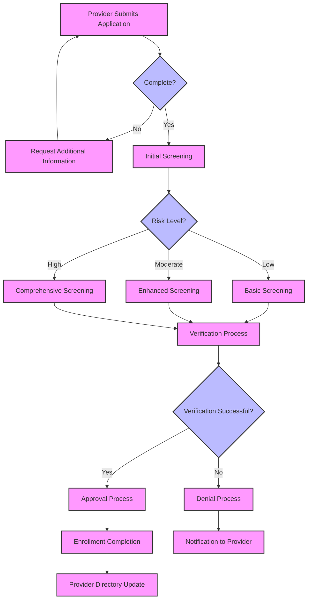
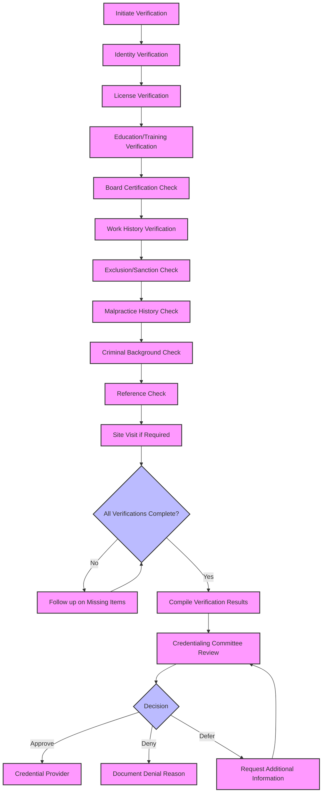
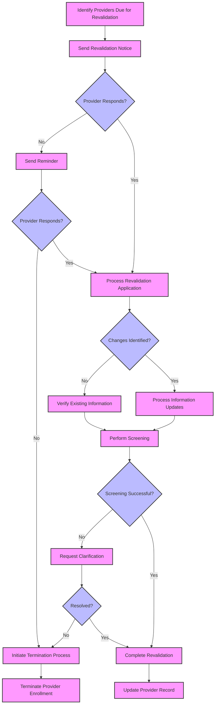

<i><b>NOTE: This information is based on MITA, which can be leveraged and updated for MITA 4.0</b></i>

This section provides guidance for implementing Medicaid provider credentialing and enrollment systems in alignment with MITA principles and this FHIR Implementation Guide.

### MITA Implementation Principles

1. **Modular Architecture**
- **Implement loosely coupled services**: Design system components with minimal dependencies between them, allowing each service to operate independently. This approach enables teams to develop, test, and deploy services separately, reducing the impact of changes and facilitating incremental modernization. For provider management systems, this might include separate services for enrollment processing, credential verification, provider directory, and reporting functions that communicate through well-defined interfaces.

- **Use microservices architecture patterns**: Organize functionality into small, focused services that each handle a specific business capability. Microservices architecture aligns with MITA's modularity principles and supports the incremental replacement of legacy systems. Each microservice should own its data model and expose functionality through APIs, enabling flexible composition of services to support complex business processes while maintaining separation of concerns.

- **Ensure each module has well-defined interfaces**: Define clear contracts between modules using interface definitions, API specifications, and data schemas. Well-defined interfaces enable modules to evolve independently as long as they maintain their contract with other modules. This approach supports interoperability between components developed by different teams or vendors and facilitates the replacement of individual modules without disrupting the entire system.

- **Implement service discovery and registry**: Develop mechanisms for services to discover and communicate with each other dynamically. Service registries maintain information about available services, their locations, and capabilities, enabling resilient communication patterns. This approach supports the dynamic addition or removal of service instances and facilitates load balancing and failover scenarios in distributed environments.

2. **API-First Design**
- **Design RESTful APIs before implementing user interfaces**: Begin development by defining and documenting APIs, treating them as first-class products rather than implementation details. This approach ensures that all functionality is accessible programmatically, enabling multiple user interfaces (web, mobile, third-party applications) to leverage the same underlying capabilities. For provider management systems, comprehensive APIs enable integration with provider portals, credentialing organizations, and other stakeholders.

- **Follow FHIR R4 specifications for healthcare data exchange**: Adhere to FHIR R4 standards for all healthcare data exchange, ensuring compatibility with the broader healthcare ecosystem. FHIR's resource-oriented approach aligns well with RESTful API design principles and provides a mature framework for representing healthcare entities. Leverage FHIR's built-in capabilities for search, versioning, and metadata to create robust, interoperable APIs.

- **Implement comprehensive API documentation and testing**: Create detailed API documentation using standards like OpenAPI/Swagger, including request/response examples, error handling, and security requirements. Implement automated API testing to ensure functionality, performance, and compliance with specifications. Provide developer portals and sandbox environments to facilitate adoption by integration partners and third-party developers.

- **Support API versioning and backward compatibility**: Implement versioning strategies that allow APIs to evolve while maintaining support for existing clients. Use techniques like URL versioning, content negotiation, or header-based versioning to manage API changes. Establish clear deprecation policies and migration paths to help consumers transition to newer API versions while minimizing disruption.

3. **Cloud-Native Approach**
- **Design for cloud deployment from the beginning**: Architect systems to leverage cloud capabilities such as elastic scaling, managed services, and geographic distribution. Cloud-native design principles include statelessness, horizontal scaling, and resilience to infrastructure failures. For provider management systems, cloud deployment enables handling variable workloads efficiently, such as during enrollment periods or revalidation cycles.

- **Use containerization technologies (Docker, Kubernetes)**: Package applications and their dependencies into containers for consistent deployment across environments. Kubernetes orchestrates container deployment, scaling, and management, providing a platform-agnostic way to run applications. Containerization supports DevOps practices like continuous integration and deployment (CI/CD) and enables consistent behavior across development, testing, and production environments.

- **Implement auto-scaling and load balancing capabilities**: Design systems to automatically adjust resources based on demand, scaling out during peak periods and scaling in during low-usage periods. Load balancing distributes traffic across multiple instances to optimize resource utilization and provide fault tolerance. These capabilities ensure responsive performance during varying load conditions while optimizing infrastructure costs.

- **Leverage managed services where appropriate**: Utilize cloud provider managed services for databases, message queues, API gateways, and other infrastructure components. Managed services reduce operational overhead, improve reliability, and often provide built-in security and compliance capabilities. This approach allows teams to focus on business functionality rather than infrastructure management, accelerating development and improving system quality.

4. **Data Standards Compliance**
- **Adopt FHIR R4 as the primary data exchange standard**: Implement FHIR R4 as the foundation for all healthcare data exchange, leveraging its comprehensive resource definitions, extension mechanisms, and interoperability capabilities. FHIR's RESTful approach aligns with modern web development practices and provides a mature framework for representing healthcare entities. For provider management, FHIR resources like Practitioner, Organization, and PractitionerRole provide standardized representations of provider data.

- **Implement US Core profiles where applicable**: Leverage US Core profiles as the foundation for US-specific healthcare data exchange, extending them as needed for Medicaid-specific requirements. US Core provides nationally recognized constraints on FHIR resources that represent the minimum data elements required for interoperability in the US healthcare system. Aligning with US Core ensures compatibility with other US healthcare systems and reduces implementation variation.

- **Use standardized code systems and value sets**: Implement industry-standard terminologies and code systems such as NUCC taxonomy codes, NPI identifiers, and other healthcare standards. Define and publish value sets for Medicaid-specific concepts, with clear governance processes for updates and versioning. Standardized terminology improves semantic interoperability, enabling systems to exchange data with consistent meaning across organizational boundaries.

- **Implement terminology services**: Develop or adopt terminology services that provide validation, lookup, and mapping capabilities for code systems and value sets. Terminology services ensure consistent use of codes across the system and support features like searching for providers by specialty or credential type. These services should include capabilities for managing state-specific codes and mapping between different code systems used by various stakeholders.

### Implementation Phases

#### Phase 1: Foundation (Months 1-6)
- **Establish development and deployment infrastructure**: Set up the technical foundation for development, testing, and production environments. This includes configuring source control repositories, continuous integration/continuous deployment (CI/CD) pipelines, and automated testing frameworks. Implement infrastructure as code (IaC) practices using tools like Terraform or AWS CloudFormation to ensure consistent, reproducible environments. Establish development workflows, code review processes, and quality gates to maintain high standards throughout the project lifecycle.

- **Implement core FHIR server capabilities**: Deploy and configure a FHIR R4 compliant server as the foundation of the provider management system. This includes implementing core FHIR operations (read, create, update, delete, search), FHIR validation capabilities, and conformance resources (CapabilityStatement, StructureDefinition). Configure the server for appropriate security, logging, and monitoring. Implement SMART on FHIR authorization to control access to resources based on user roles and permissions.

- **Develop basic provider and organization profiles**: Create FHIR profiles for core provider data entities (Practitioner, Organization, PractitionerRole, Location) based on US Core profiles with Medicaid-specific extensions. Define constraints, extensions, and value sets needed for provider credentialing and enrollment. Implement validation rules to ensure data quality and compliance with business requirements. Create example resources demonstrating proper use of profiles for different provider types and scenarios.

- **Create initial API endpoints for CRUD operations**: Develop and document RESTful API endpoints for basic create, read, update, and delete operations on provider resources. Implement appropriate search parameters to support common query patterns. Create API documentation using standards like OpenAPI/Swagger, including request/response examples and error handling. Develop client libraries or sample code to facilitate integration by external systems and demonstrate proper API usage.

#### Phase 2: Core Functionality (Months 7-12)
- **Implement provider enrollment workflows**: Develop workflow capabilities to orchestrate the provider enrollment process from application submission through approval or denial. Implement state machines to track application status and manage transitions between states. Create task management capabilities to assign work items to appropriate staff and track completion. Develop document management features to handle supporting documentation and maintain audit trails of all enrollment activities.

- **Add credentialing status tracking**: Implement mechanisms to track and manage provider credentialing status throughout the enrollment and maintenance lifecycle. Create data structures to store verification results for different credential types (licenses, certifications, education, work history, etc.). Develop dashboards to monitor credentialing status across the provider population and identify items requiring attention. Implement notification systems to alert staff and providers about upcoming credential expirations or verification issues.

- **Develop verification and validation processes**: Create automated and manual processes for verifying provider credentials and validating application information. Implement integration with primary source verification services for automated credential verification. Develop workflows for manual verification when automated verification is not possible. Implement validation rules to ensure data completeness, consistency, and accuracy. Create verification result tracking to document the source, method, date, and outcome of each verification activity.

- **Create provider directory capabilities**: Develop a searchable provider directory based on verified provider information. Implement search capabilities to find providers by location, specialty, network affiliation, and other criteria. Create APIs to expose provider directory data to internal and external consumers. Develop mechanisms to keep directory information current based on provider updates and verification activities. Implement directory quality metrics to monitor accuracy and completeness.

#### Phase 3: Advanced Features (Months 13-18)
- **Implement automated screening processes**: Develop automated screening capabilities to check providers against exclusion databases, verify licenses, and identify potential issues. Implement integration with federal and state exclusion databases (OIG LEIE, SAM, state Medicaid exclusion lists). Create automated processes for periodic rescreening of enrolled providers. Develop matching algorithms to identify potential matches with appropriate sensitivity and specificity. Implement workflows for human review of potential matches to minimize false positives.

- **Add risk-based categorization**: Implement risk assessment capabilities to categorize providers by risk level (Limited, Moderate, High) as required by federal regulations. Develop rules engines to determine risk levels based on provider type, ownership structure, prior adverse actions, and other factors. Create workflows to apply appropriate screening measures based on risk level. Implement monitoring capabilities to identify changes in risk factors that might warrant risk level reassessment.

- **Develop reporting and analytics capabilities**: Create comprehensive reporting and analytics features to support program management, compliance monitoring, and performance improvement. Implement standard reports for enrollment status, verification outcomes, and provider demographics. Develop interactive dashboards for monitoring key performance indicators and operational metrics. Create ad-hoc query capabilities for flexible data analysis. Implement data export mechanisms for regulatory reporting and integration with data warehouses.

- **Integrate with external verification sources**: Establish connections with authoritative data sources for automated verification of provider credentials and eligibility. Implement integration with state licensing boards for real-time license verification. Develop connections to federal databases for exclusion checking and NPI validation. Create interfaces with specialty boards for certification verification. Implement integration with background check services for criminal history screening. Develop reconciliation processes to handle discrepancies between data sources.

#### Phase 4: Optimization (Months 19-24)
- **Implement machine learning for fraud detection**: Develop advanced analytics capabilities using machine learning to identify potentially fraudulent activities or high-risk providers. Implement anomaly detection algorithms to identify unusual patterns in provider data or behavior. Create predictive models to assess fraud risk based on provider characteristics and historical patterns. Develop entity resolution capabilities to identify hidden relationships between providers, organizations, and owners. Implement feedback loops to continuously improve model accuracy based on investigation outcomes.

- **Add predictive analytics capabilities**: Develop predictive models to anticipate provider enrollment trends, identify potential compliance issues, and optimize program operations. Implement forecasting tools for enrollment volumes, provider turnover, and resource requirements. Create early warning systems for potential network adequacy issues or provider shortages. Develop models to predict which providers might require additional scrutiny during revalidation. Implement recommendation engines to suggest process improvements based on operational data.

- **Optimize performance and scalability**: Enhance system performance and scalability to handle growing provider populations and increasing transaction volumes. Implement performance testing and optimization for high-volume operations. Develop caching strategies for frequently accessed data. Create database indexing and query optimization for improved response times. Implement horizontal scaling capabilities to handle peak loads. Develop data archiving strategies for historical information while maintaining accessibility for reporting and analysis.

- **Enhance user experience and automation**: Improve user interfaces and automate routine tasks to increase efficiency and user satisfaction. Develop intuitive, role-based user interfaces tailored to different user types (providers, state staff, administrators). Implement workflow automation to reduce manual steps and streamline processes. Create intelligent form filling and validation to minimize data entry errors. Develop self-service capabilities for providers to update information and track application status. Implement context-aware help and guidance to assist users through complex processes.

### Technical Architecture

#### System Components

##### FHIR Server
- **Central repository for all provider-related data**: Serves as the authoritative source for all provider information, including demographics, credentials, relationships, and enrollment status. The FHIR server provides a unified data model that supports the entire provider lifecycle, from initial enrollment through ongoing maintenance and eventual disenrollment. This centralized approach eliminates data silos and ensures consistent provider information across all system components and stakeholders.

- **Implements FHIR R4 specification**: Adheres to the FHIR R4 standard, providing a mature, widely-adopted framework for healthcare data representation and exchange. The implementation includes support for all required FHIR resources, operations, and capabilities defined in the specification. Conformance resources (CapabilityStatement, StructureDefinition, SearchParameter) document the server's capabilities and constraints, enabling clients to understand what functionality is available.

- **Supports RESTful API operations**: Provides a comprehensive set of RESTful API operations (read, create, update, delete, search, history) across all supported resource types. The API follows RESTful principles including resource-oriented design, stateless operations, and standard HTTP methods. Advanced operations such as batch/transaction processing, conditional updates, and patch operations support efficient data manipulation for complex scenarios.

- **Provides search and query capabilities**: Implements robust search functionality with support for all standard FHIR search parameters plus custom parameters defined for Medicaid-specific use cases. Search capabilities include support for complex queries with multiple parameters, chained searches across related resources, and inclusion of related resources in search results. Performance optimization techniques ensure responsive search performance even with large provider datasets.

#### Key Process Workflow Diagrams

##### Provider Enrollment Workflow



##### Credentialing Verification Workflow



##### Revalidation Workflow



##### Provider Enrollment Service
- **Manages provider application processes**: Orchestrates the end-to-end provider enrollment process, from initial application submission through final approval or denial. This includes application intake, validation, processing, and decision management. The service implements configurable workflows that can be adapted to state-specific requirements while maintaining alignment with federal regulations. It provides capabilities for handling different provider types, enrollment pathways, and application scenarios.

- **Implements workflow orchestration**: Coordinates the sequence of activities required for provider enrollment, ensuring that all necessary steps are completed in the proper order. The workflow engine manages state transitions, task assignments, parallel processing, and conditional branching based on provider characteristics and application data. It implements timeouts, escalations, and exception handling to ensure applications progress through the enrollment process efficiently.

- **Handles document management**: Manages the collection, storage, validation, and retrieval of supporting documentation required for provider enrollment. This includes capabilities for document upload, classification, version control, and retention policy enforcement. The service implements document validation to ensure completeness and legibility, and maintains associations between documents and specific credentials or application elements they support.

- **Provides status tracking**: Maintains comprehensive tracking of application status throughout the enrollment process, with detailed history of status changes, responsible parties, and processing times. The service provides real-time status information to both providers and staff through appropriate interfaces. It implements configurable notifications for status changes and approaching deadlines, helping to keep the enrollment process moving forward.

##### Credentialing Service
- **Manages credentialing workflows**: Coordinates the processes for verifying provider credentials, including primary source verification, credential evaluation, and committee review. The service implements configurable workflows that can accommodate different credentialing models, including direct credentialing by the state Medicaid agency and delegated credentialing through managed care organizations or credentialing verification organizations (CVOs). It supports both initial credentialing and recredentialing processes.

- **Implements verification processes**: Executes the verification of provider credentials against primary and secondary sources, tracking verification methods, results, and expiration dates. The service implements verification rules based on provider type, specialty, and risk level, ensuring appropriate verification of all required credentials. It supports both automated verification through integration with authoritative sources and manual verification processes with appropriate documentation.

- **Tracks credentialing status**: Maintains comprehensive tracking of credentialing status for each provider, including verification status for individual credentials, overall credentialing decisions, and credentialing history. The service provides dashboards and reports to monitor credentialing status across the provider population, identifying items requiring attention or approaching expiration. It implements notifications for credential expirations, verification issues, and credentialing decisions.

- **Manages revalidation cycles**: Coordinates the periodic revalidation of provider enrollment and credentials as required by federal regulations (at least every 5 years, or 3 years for high-risk providers). The service identifies providers due for revalidation, initiates the revalidation process, tracks completion of required activities, and updates provider status based on revalidation outcomes. It implements streamlined revalidation workflows that focus on changes since the last validation while maintaining program integrity.

##### Verification Service
- **Interfaces with external verification sources**: Establishes and maintains connections with authoritative data sources for verification of provider credentials and eligibility. This includes integration with state licensing boards, federal exclusion databases (OIG LEIE, SAM), specialty certification boards, educational institutions, and other verification sources. The service implements appropriate authentication, data exchange protocols, and error handling for each external system.

- **Implements primary source verification**: Executes verification of provider credentials directly with the issuing or authoritative source, in accordance with credentialing industry standards. The service supports multiple verification methods including direct API integration, secure web services, batch file exchange, and manual verification with documentation. It implements verification rules to determine which credentials require primary source verification versus secondary source verification.

- **Manages verification results**: Captures and stores the outcomes of verification activities, including verification source, method, date, status, and supporting documentation. The service maintains a comprehensive history of verification activities for each credential, enabling audit and compliance reporting. It implements rules for handling verification discrepancies, including workflows for provider clarification and documentation of resolution.

- **Provides audit trails**: Maintains detailed records of all verification activities, including who performed the verification, when it was performed, what method was used, and what the outcome was. The service ensures that all verification activities are properly documented to support compliance with regulatory requirements and accreditation standards. It implements secure, immutable audit trails that cannot be altered or deleted, ensuring the integrity of verification records.

##### Provider Directory
- **Maintains searchable provider directory**: Serves as the authoritative source for provider directory information, ensuring accurate, up-to-date provider data is available to beneficiaries, managed care organizations, and other stakeholders. The directory includes comprehensive provider information such as demographics, specialties, practice locations, network affiliations, panel status, and contact information. It implements data quality controls to ensure directory accuracy and completeness.

- **Implements provider lookup capabilities**: Provides robust search functionality to find providers based on various criteria including location, specialty, network affiliation, languages spoken, accessibility features, and acceptance of new patients. The service supports both exact and proximity-based location searches, allowing beneficiaries to find providers near their home or work. It implements user-friendly interfaces for different user types, including beneficiaries with varying levels of technical proficiency.

- **Supports network adequacy reporting**: Enables analysis and reporting on provider network adequacy based on time/distance standards, provider-to-beneficiary ratios, and appointment availability. The service provides data to support network adequacy monitoring by state agencies and managed care organizations, helping to identify network gaps and ensure compliance with network adequacy requirements. It implements geospatial analysis capabilities to evaluate provider coverage across service areas.

- **Provides public-facing search interface**: Offers a user-friendly, accessible interface for beneficiaries and the public to search for providers, view provider details, and access provider contact information. The service implements responsive design principles to ensure usability across devices, including desktop computers, tablets, and smartphones. It supports accessibility features to ensure that the directory is usable by people with disabilities, in compliance with Section 508 and WCAG guidelines.

#### Integration Patterns

##### Synchronous Integration
- **Real-time API calls for immediate responses**: Implements synchronous request-response patterns for operations that require immediate feedback, such as provider lookups, credential verification checks, and application status inquiries. Synchronous integration is appropriate for user-facing operations where users are waiting for results, interactive workflows that require immediate decisions, and simple operations that can be completed quickly. This pattern provides the most straightforward implementation for direct system-to-system communication.

- **Used for provider lookups and status checks**: Applies synchronous integration patterns to scenarios like provider directory searches, credential verification status checks, and enrollment application status inquiries. These operations typically require immediate responses to support user interactions and workflow decisions. The pattern ensures that users receive timely information without having to wait for asynchronous processing or check back later for results.

- **Implements timeout and retry mechanisms**: Includes robust error handling with appropriate timeouts to prevent indefinite waiting when services are slow or unresponsive. Implements intelligent retry strategies with exponential backoff for transient failures, ensuring resilience without overwhelming downstream systems. Circuit breaker patterns prevent cascading failures when dependent services experience prolonged issues, allowing the system to degrade gracefully rather than fail completely.

- **Provides immediate feedback to users**: Delivers real-time responses to user actions, supporting interactive workflows and immediate decision-making. This approach improves user experience by eliminating waiting periods for common operations and providing clear feedback about success or failure. For provider portals and staff interfaces, immediate feedback is essential for efficient workflow completion and user satisfaction.

##### Asynchronous Integration
- **Message-based integration for long-running processes**: Implements asynchronous, message-based integration patterns for operations that may take significant time to complete, such as comprehensive background checks, complex verification workflows, and batch processing operations. This approach decouples service producers from consumers, allowing each to operate at its own pace without blocking. Message queues or event streams provide reliable delivery, persistence, and processing guarantees.

- **Used for verification workflows and batch processing**: Applies asynchronous patterns to scenarios like primary source verification, exclusion database checks, and batch enrollment processing. These operations often involve external systems with varying response times or require coordination of multiple steps that may take minutes, hours, or even days to complete. Asynchronous processing allows these operations to proceed in the background while users continue with other tasks.

- **Implements event-driven architecture**: Designs systems around the production, detection, and consumption of events representing significant state changes or business activities. Events such as "ApplicationSubmitted," "VerificationCompleted," or "EnrollmentApproved" trigger appropriate processing by interested components without tight coupling between services. This approach enables complex workflow orchestration, real-time monitoring, and flexible system evolution.

- **Provides eventual consistency guarantees**: Ensures that all system components will eventually reflect consistent state, even though temporary inconsistencies may exist during processing. This model acknowledges that in distributed systems, especially those with asynchronous processing, perfect consistency at all times is impractical. Instead, the system is designed to converge on a consistent state within defined timeframes, with appropriate mechanisms to detect and resolve conflicts.

##### Batch Integration
- **Scheduled data synchronization processes**: Implements periodic batch processing for operations that involve large volumes of data or that need to be coordinated across multiple systems. Batch processes run on defined schedules (hourly, daily, weekly) to perform activities like bulk data updates, reconciliation between systems, and comprehensive reporting. This approach efficiently handles operations that don't require real-time processing and can benefit from optimized bulk processing.

- **Used for reporting and analytics**: Applies batch processing patterns to scenarios like regulatory reporting, data warehouse loading, and analytics processing. These operations typically involve aggregating and transforming large volumes of data from multiple sources, which is more efficient as a scheduled batch process than as real-time processing. Batch reporting ensures consistent point-in-time views of data for compliance and business intelligence purposes.

- **Implements incremental data loading**: Optimizes batch processes by processing only new or changed data since the previous run, rather than reprocessing all data each time. This approach significantly reduces processing time and resource consumption for large datasets. Incremental processing requires tracking of data changes through timestamps, version numbers, or change logs, and implementing reconciliation mechanisms to ensure data integrity.

- **Provides data quality validation**: Incorporates comprehensive data quality checks into batch processes to identify and address data issues before they propagate through the system. Validation includes checks for completeness, accuracy, consistency, and conformance to business rules. Batch processes generate data quality metrics and exception reports, enabling systematic improvement of data quality over time. Failed records can be routed to error handling workflows for resolution.

### Data Management

#### Data Quality Framework
- **Implement data validation rules at API level**: Establish comprehensive validation at the API entry points to ensure data quality at the source. This includes syntactic validation (correct data types, formats, and structures), semantic validation (business rule compliance), and referential integrity checks (valid references to other resources). API-level validation prevents invalid data from entering the system, reducing downstream data quality issues and the need for data cleansing. Validation rules should be consistently applied across all interfaces, including user interfaces, APIs, and batch processes.

- **Use FHIR validation capabilities**: Leverage FHIR's built-in validation mechanisms, including profile-based validation, terminology validation, and reference validation. FHIR profiles define constraints on resources that can be automatically validated, ensuring conformance to implementation guide requirements. StructureDefinition resources formally define these constraints, enabling automated validation by FHIR servers and client applications. Terminology validation ensures that codes come from the specified value sets, supporting semantic interoperability.

- **Implement business rule validation**: Develop and implement business rules that enforce Medicaid-specific requirements beyond basic structural validation. This includes complex cross-field validations, conditional requirements, and policy-based constraints. Business rules should be externalized from application code where possible, enabling them to be managed, versioned, and updated independently. Rules engines or decision services can provide centralized rule execution with consistent application across all system components.

- **Provide data quality metrics and reporting**: Establish comprehensive data quality monitoring with metrics for completeness, accuracy, consistency, timeliness, and conformance to standards. Implement dashboards and reports that track data quality trends over time, highlighting areas for improvement. Data quality metrics should be integrated with operational KPIs to demonstrate the business impact of data quality. Exception reporting identifies specific data quality issues requiring remediation, with workflows for investigation and correction.

- **Implement master data management**: Establish provider data as a master data domain with centralized governance and stewardship. Implement processes for data standardization, deduplication, and reconciliation to maintain a single source of truth for provider information. Master data management capabilities should include matching algorithms to identify potential duplicates, merge/unmerge functionality to combine or separate records, and lineage tracking to document the source and history of provider data.

- **Develop data governance framework**: Establish formal data governance with clear roles, responsibilities, policies, and procedures for managing provider data. Data governance should address data ownership, quality standards, privacy requirements, retention policies, and access controls. Governance committees with representation from business and technical stakeholders ensure that data management practices align with organizational objectives and regulatory requirements. Data stewards are responsible for monitoring and improving data quality within their domains.

### Implementation Patterns for Exclusions and Sanctions

#### Exclusion and Sanction Checking Pattern

This pattern provides a standardized approach for checking provider exclusions and sanctions across federal and state databases.

##### Resources Used
- `MedicaidPractitioner` - The provider being checked
- `MedicaidVerificationResult` - Results of exclusion/sanction checks
- `MedicaidPractitionerRole` - For updating enrollment status based on findings

##### Implementation Steps

1. **Configure Exclusion Sources**
   - **Implement connections to required exclusion databases**: Establish secure, reliable integration with all mandatory exclusion and sanction data sources required for comprehensive provider screening. This involves developing and maintaining interfaces with multiple federal and state systems, each with its own data formats, access methods, and update frequencies. The implementation should include proper authentication, error handling, retry logic, and monitoring to ensure continuous availability of these critical verification sources.
     
     - **OIG List of Excluded Individuals/Entities (LEIE)**: Integrate with the Office of Inspector General's LEIE database, which is the primary federal source for healthcare exclusions. Implementation options include monthly file downloads, API integration where available, or web service calls. The integration should handle both the monthly full replacement files and the monthly update files to optimize processing. Proper matching algorithms must be implemented to handle name variations, address changes, and other identifying information that may differ slightly between systems.
     
     - **System for Award Management (SAM)**: Connect to the federal SAM database, which includes debarred and excluded providers across all federal programs. SAM integration typically involves API access with appropriate federal credentials and security protocols. The implementation should address the complexities of SAM's hierarchical data structure, which includes entity registrations, exclusion records, and hierarchical relationships between organizations.
     
     - **State Medicaid exclusion lists**: Implement connections to state-specific exclusion and sanction databases, which may vary significantly in format and accessibility across different states. For multi-state implementations, this requires a flexible architecture that can accommodate different data sources, formats, and update frequencies. The system should maintain a registry of state-specific data sources with appropriate metadata about update frequency, contact information, and access methods.
     
     - **State licensing board disciplinary actions**: Establish integration with state professional licensing boards to identify disciplinary actions that may not appear in federal exclusion databases. This typically requires state-specific implementations, as licensing board data access methods vary widely. The implementation should include capabilities to interpret and categorize different types of disciplinary actions and their implications for Medicaid enrollment eligibility.
     
     - **NPDB reports (if applicable)**: If authorized, implement integration with the National Practitioner Data Bank for comprehensive background information on adverse actions. NPDB access requires specific organizational authorization and adherence to strict usage policies. The implementation must include proper security controls, audit logging, and purpose-of-use tracking to ensure compliance with NPDB requirements.

2. **Implement Verification Process**
   - **Define FHIR profile for verification results**: Create a standardized FHIR profile to capture exclusion and sanction check results in a consistent, interoperable format. This profile extends the base VerificationResult resource with Medicaid-specific extensions to capture detailed information about exclusion checks, including the source database, match status, and verification details. The profile should be designed to support both automated and manual verification processes, with appropriate documentation of verification methods, timestamps, and outcomes.

   ```fsh
   Profile: ExclusionSanctionCheck
   Parent: MedicaidVerificationResult
   Id: exclusion-sanction-check
   Title: "Exclusion and Sanction Check"
   Description: "Verification result for provider exclusion and sanction checks"
   * ^status = #active
   * extension contains
       checkTimestamp 1..1 and
       checkSource 1..* and
       matchStatus 1..1 and
       matchDetails 0..1
   * extension[checkTimestamp].value[x] only dateTime
   * extension[checkSource].value[x] only CodeableConcept
   * extension[checkSource].valueCodeableConcept from ExclusionSanctionSources (required)
   * extension[matchStatus].value[x] only code
   * extension[matchStatus].valueCode from #match | #no-match | #possible-match
   * extension[matchDetails].value[x] only string
   * status 1..1
   * target 1..1
   * target only Reference(MedicaidPractitioner or MedicaidOrganization)
   * validationType 1..1
   * validationType = http://terminology.hl7.org/CodeSystem/validation-type#primary "Primary Source"
   * validationProcess 1..*
   * validationProcess from ExclusionCheckMethods (required)
   * primarySource 1..*
   * primarySource.who 1..1
   * primarySource.validationStatus 1..1
   * primarySource.validationDate 1..1
   ```

   - **Implement verification service**: Develop a dedicated verification service responsible for executing exclusion and sanction checks against configured data sources. This service should implement appropriate matching algorithms, handle the complexities of different data formats and access methods, and produce standardized verification results. The service should support both synchronous (real-time) and asynchronous (batch) verification modes to accommodate different use cases and performance requirements.

   - **Create verification result storage**: Establish a persistent storage mechanism for verification results, ensuring that all checks are properly documented for audit and compliance purposes. This includes storing the complete verification history for each provider, with appropriate retention policies based on regulatory requirements. The storage solution should support efficient querying for both operational and reporting purposes, with appropriate indexing and archiving strategies.

   - **Implement verification workflow**: Develop workflow capabilities to orchestrate the verification process, including scheduling checks, handling exceptions, and managing manual review processes. The workflow should include appropriate status tracking, notifications, and escalation paths to ensure timely completion of verification activities. Integration with task management systems enables assignment of manual verification tasks to appropriate staff and tracking of verification progress.

3. **Implement Automated Checking**
   - **Develop scheduled batch processes for checking all active providers**: Create automated, scheduled processes to periodically check all enrolled providers against exclusion databases. This includes configuring job scheduling, defining provider selection criteria, implementing efficient batch processing logic, and managing the verification results. The batch processes should be designed to handle large volumes of providers efficiently, with appropriate error handling, retry logic, and monitoring. Batch processes should be scheduled based on database update frequencies (e.g., monthly for LEIE updates) and compliance requirements.

   - **Implement real-time checks during enrollment and revalidation**: Integrate exclusion checks directly into the provider enrollment and revalidation workflows, ensuring that providers are screened at critical decision points. This includes implementing synchronous verification calls within the application workflow, with appropriate timeout handling and fallback mechanisms. Real-time checks should be optimized for performance to avoid delaying the enrollment process, with caching of recent verification results where appropriate to reduce redundant checks.

   - **Create APIs for on-demand verification**: Develop RESTful APIs that allow authorized systems and users to initiate exclusion checks on demand. This includes implementing appropriate authentication, authorization, request validation, and response formatting. The APIs should support both individual provider checks and batch verification requests, with appropriate rate limiting and throttling to prevent system overload. Documentation should clearly specify request parameters, response formats, error handling, and usage examples.

   - **Implement monitoring and alerting**: Establish comprehensive monitoring of the automated checking processes, including success rates, processing times, error rates, and verification outcomes. Configure alerts for critical failures, unexpected verification results, or processing delays. Implement dashboards to track verification metrics over time, identifying trends and potential issues before they impact compliance or operations.

4. **Define Match Processing Logic**
   - **Implement exact matching using NPI, SSN/TIN, and name**: Develop precise matching algorithms that identify exact matches based on unique identifiers such as National Provider Identifier (NPI), Social Security Number (SSN), Tax Identification Number (TIN), and exact name matches. This approach provides high confidence matches with minimal false positives, but may miss matches with data entry errors or variations. The implementation should include appropriate security controls for handling sensitive identifiers like SSN, with encryption and access restrictions.

   - **Develop fuzzy matching algorithms for name variations**: Create sophisticated matching algorithms that can identify potential matches despite variations in name spelling, formatting, or order. This includes implementing techniques such as phonetic matching (Soundex, Metaphone), edit distance calculations (Levenshtein, Jaro-Winkler), n-gram analysis, and machine learning approaches. Fuzzy matching is essential for identifying exclusions where identifiers may not match exactly due to data entry errors, name changes, or formatting differences between systems.

   - **Create process for manual review of potential matches**: Establish workflows for human review of potential matches that cannot be automatically confirmed or rejected with high confidence. This includes developing user interfaces for reviewing match details, comparing provider information with exclusion records, documenting review decisions, and updating provider status based on review outcomes. The manual review process should include appropriate task assignment, prioritization, and tracking to ensure timely resolution of potential matches.

   - **Document match confidence scoring methodology**: Define and document a comprehensive methodology for assessing match confidence, including scoring algorithms, threshold values for different actions, and validation of scoring effectiveness. The scoring methodology should consider multiple factors including identifier matches, name similarity, demographic alignment, and other corroborating information. Documentation should include the rationale for scoring weights, threshold values, and validation results to support compliance requirements and audit inquiries.

   - **Implement continuous improvement process**: Establish mechanisms to continuously improve matching accuracy based on feedback from manual reviews, false positive/negative analysis, and evolving best practices. This includes tracking match quality metrics, analyzing patterns in false matches, and periodically refining matching algorithms and parameters. The improvement process should include regular validation using known test cases to ensure that algorithm changes maintain or improve overall matching accuracy.

5. **Implement Status Update Workflow**
   - **Design comprehensive workflow for handling exclusion matches**: Develop a structured workflow that defines the process for handling different match scenarios, from initial detection through resolution. The workflow should include clear decision points, action steps, responsible parties, and expected outcomes for each path. This workflow diagram serves as the blueprint for implementing the technical components and business processes required for effective exclusion management.

   ```mermaid
   flowchart TD
       A[Exclusion Check Initiated] --> B{Match Found?}
       B -->|No Match| C[Document Clean Check]
       B -->|Potential Match| D[Manual Review]
       B -->|Exact Match| E[Automatic Suspension]
       D --> F{Confirmed Match?}
       F -->|No| C
       F -->|Yes| E
       E --> G[Update Provider Status]
       G --> H[Generate Notification]
       H --> I[Document Action]
       C --> J[Continue Normal Processing]
       
       classDef process fill:#f9f,stroke:#333,stroke-width:2px;
       classDef decision fill:#bbf,stroke:#333,stroke-width:2px;
       classDef endpoint fill:#bfb,stroke:#333,stroke-width:2px;
       
       class A,C,D,E,G,H,I,J process;
       class B,F decision;
   ```

   - **Implement automated status transitions**: Develop system capabilities to automatically update provider status based on verification results, following predefined business rules. This includes implementing the logic to determine appropriate status changes based on match type, confidence level, and provider characteristics. The implementation should include safeguards to prevent inappropriate automatic actions, such as requiring human confirmation for certain high-impact status changes.

   - **Create manual review interfaces**: Develop user interfaces for staff to review potential matches that require human judgment. These interfaces should present all relevant information from both the provider record and the exclusion source, highlighting key matching elements and discrepancies. The review interface should support efficient decision-making with clear options for confirming or rejecting matches, documenting rationale, and initiating appropriate follow-up actions.

   - **Implement audit and compliance documentation**: Ensure comprehensive documentation of all status update activities to support audit and compliance requirements. This includes capturing the complete decision trail from initial match detection through final resolution, with timestamps, user identification, and justification for all actions taken. The documentation should be tamper-resistant and retained according to regulatory requirements.

6. **Implement Provider Status Updates**
   - **Update `MedicaidPractitionerRole.extension:enrollmentStatus`**: Develop the technical capability to modify the provider's enrollment status in response to exclusion findings. This includes implementing the data model extensions to capture status changes, effective dates, and related metadata. The implementation should ensure data integrity through appropriate validation, transaction management, and conflict resolution mechanisms when multiple processes attempt to update status simultaneously.

   - **Create task for compliance officer review**: Implement integration with task management systems to automatically generate review tasks for compliance officers when exclusions are identified. These tasks should include all relevant information about the exclusion, the affected provider, and required actions. Task assignment should follow configurable rules based on provider type, exclusion source, organizational structure, and workload balancing to ensure timely review by appropriate staff.

   - **Generate appropriate notifications**: Develop a comprehensive notification system to alert relevant stakeholders about exclusion-related status changes. This includes configurable templates for different notification types, delivery mechanisms (email, SMS, in-app, etc.), and recipient rules. Notifications should be appropriately secured when containing sensitive information and should include clear instructions for any required recipient actions.

   - **Document action in audit log**: Implement secure, immutable audit logging for all status update actions to support compliance and forensic analysis requirements. Audit logs should capture detailed information about what changed, when it changed, who made the change, and why the change was made. The logging system should be designed for high performance to avoid impacting system operations while ensuring no actions are missed.

   - **Implement appeals and exceptions process**: Develop capabilities to manage provider appeals and exception requests related to exclusion findings. This includes workflows for receiving appeals, gathering supporting documentation, routing to appropriate reviewers, documenting decisions, and implementing resulting status changes. The process should include appropriate checks and balances to ensure fair treatment while maintaining program integrity.

7. **Example Implementation**
   - **Create comprehensive FHIR resource examples**: Develop detailed, realistic examples of FHIR resources that demonstrate the exclusion checking pattern in action. These examples serve multiple purposes: they provide implementation guidance, serve as validation test cases, and illustrate the expected data structures and relationships. The examples should cover various scenarios including exact matches, potential matches requiring review, and clean checks with no matches found.

   - **Demonstrate proper resource relationships**: Show how different FHIR resources interact in the exclusion checking process, including the relationships between provider resources (Practitioner, Organization, PractitionerRole) and verification resources (VerificationResult). The examples should illustrate proper referencing between resources, appropriate use of extensions, and conformance to profiles defined in the implementation guide.

   - **Illustrate complete verification lifecycle**: Provide examples that demonstrate the complete lifecycle of an exclusion check, from initial verification request through final resolution. This includes examples of verification results at different stages (pending, in-review, validated), with appropriate status transitions and documentation of verification activities.

   ```json
   {
     "resourceType": "MedicaidVerificationResult",
     "id": "exclusion-check-example",
     "meta": {
       "profile": [
         "http://hl7.org/fhir/us/medicaid-provider-credentialing/StructureDefinition/exclusion-sanction-check"
       ]
     },
     "extension": [
       {
         "url": "checkTimestamp",
         "valueDateTime": "2023-06-15T14:30:00Z"
       },
       {
         "url": "checkSource",
         "valueCodeableConcept": {
           "coding": [
             {
               "system": "http://hl7.org/fhir/us/medicaid-provider-credentialing/CodeSystem/exclusion-sanction-sources",
               "code": "leie",
               "display": "OIG List of Excluded Individuals/Entities"
             }
           ]
         }
       },
       {
         "url": "matchStatus",
         "valueCode": "match"
       },
       {
         "url": "matchDetails",
         "valueString": "Excluded for Medicare fraud on 2022-03-15, exclusion period 5 years"
       }
     ],
     "status": "validated",
     "target": [
       {
         "reference": "Practitioner/excluded-provider-example"
       }
     ],
     "validationType": {
       "coding": [
         {
           "system": "http://terminology.hl7.org/CodeSystem/validation-type",
           "code": "primary",
           "display": "Primary Source"
         }
       ]
     },
     "validationProcess": [
       {
         "coding": [
           {
             "system": "http://hl7.org/fhir/us/medicaid-provider-credentialing/CodeSystem/exclusion-check-methods",
             "code": "api-check",
             "display": "API Verification"
           }
         ]
       }
     ],
     "primarySource": [
       {
         "who": {
           "display": "Office of Inspector General"
         },
         "validationStatus": {
           "coding": [
             {
               "system": "http://hl7.org/fhir/us/medicaid-provider-credentialing/CodeSystem/medicaid-verification-status",
               "code": "verified",
               "display": "Verified"
             }
           ]
         },
         "validationDate": "2023-06-15"
       }
     ]
   }
   ```

   - **Provide implementation notes and best practices**: Accompany examples with detailed implementation notes that explain key design decisions, potential implementation challenges, and recommended best practices. These notes should address common questions and issues that implementers might encounter, such as handling of sensitive data, performance considerations for large-scale checking, and integration with existing systems.

   - **Include validation examples**: Develop examples specifically designed to validate implementation correctness, including edge cases and error scenarios. These validation examples can be used in automated testing to ensure that implementations correctly handle various exclusion checking scenarios, from straightforward matches to complex cases requiring sophisticated matching algorithms and human review.

#### Sanction Management Pattern

This pattern provides a standardized approach for managing provider sanctions imposed by the state Medicaid program.

##### Resources Used
- `MedicaidPractitioner` or `MedicaidOrganization` - The sanctioned provider
- `MedicaidPractitionerRole` - For managing enrollment status
- `MedicaidVerificationResult` - For documenting sanction verification
- `Task` - For managing sanction workflow
- `Communication` - For sanction notifications

##### Implementation Steps

1. **Define Sanction Types and Codes**
   - **Create standardized terminology for sanctions**: Develop a comprehensive code system that defines all possible sanction types that can be applied to providers in the Medicaid program. This standardized terminology ensures consistent representation of sanctions across systems, supports interoperability, and enables meaningful analytics. The code system should be designed to accommodate both federal and state-specific sanction types, with clear definitions and appropriate hierarchical relationships.

   - **Implement as FHIR CodeSystem resource**: Define the sanction types as a formal FHIR CodeSystem resource, following FHIR terminology best practices. This includes providing appropriate metadata, concept definitions, and hierarchical relationships. The CodeSystem should be published as part of the implementation guide, making it available to all implementers and ensuring consistent interpretation of sanction codes.

   - **Support extensibility for state-specific sanctions**: Design the code system to allow for extension with state-specific sanction types while maintaining compatibility with the core set of federally defined sanctions. This extensibility mechanism enables states to address their unique regulatory requirements while preserving interoperability with federal systems and other states.

   ```fsh
   CodeSystem: MedicaidSanctionTypes
   Id: medicaid-sanction-types
   Title: "Medicaid Sanction Types"
   Description: "Types of sanctions that can be applied to Medicaid providers"
   * ^url = "http://hl7.org/fhir/us/medicaid-provider-credentialing/CodeSystem/medicaid-sanction-types"
   * ^status = #active
   * ^caseSensitive = true
   * ^content = #complete
   * #payment-suspension "Payment Suspension" "Suspension of Medicaid payments"
   * #enrollment-suspension "Enrollment Suspension" "Temporary suspension of enrollment"
   * #enrollment-termination "Enrollment Termination" "Termination of enrollment"
   * #prepayment-review "Prepayment Review" "Claims subject to prepayment review"
   * #enhanced-oversight "Enhanced Oversight" "Provider placed under enhanced oversight"
   * #corrective-action "Corrective Action Plan" "Provider required to complete corrective action plan"
   * #payment-restriction "Payment Restriction" "Restrictions on payment methods or amounts"
   * #service-restriction "Service Restriction" "Restrictions on services provider can bill"
   ```

   - **Create associated ValueSet resources**: Develop ValueSet resources that define the allowable subsets of sanction types for different contexts, such as provider types, program areas, or use cases. These ValueSets can be referenced in profiles and implementation guides to constrain the allowable sanction types in specific scenarios, ensuring appropriate application of sanctions.

   - **Provide mapping to external code systems**: Establish mappings between the Medicaid sanction types and related external code systems, such as those used by federal partners, managed care organizations, or other healthcare entities. These mappings facilitate data exchange and integration with external systems, supporting broader interoperability beyond the Medicaid enterprise.

2. **Implement Sanction Application Workflow**
   - **Design comprehensive sanction workflow**: Develop a structured workflow that defines the end-to-end process for applying sanctions to providers, from initial decision through implementation and monitoring. This workflow serves as the blueprint for implementing the technical components and business processes required for effective sanction management. The workflow should accommodate different sanction types, provider categories, and regulatory requirements while ensuring consistent application of policies.

   - **Document workflow with process diagram**: Create a visual representation of the sanction workflow to facilitate understanding and implementation. The diagram should clearly illustrate the sequence of activities, decision points, and information flows involved in the sanction process. This visual documentation helps ensure that all stakeholders have a shared understanding of the process and supports consistent implementation across the organization.

   ```mermaid
   flowchart TD
       A[Sanction Decision Made] --> B[Create Sanction Record]
       B --> C[Update Provider Status]
       C --> D[Generate Provider Notification]
       D --> E[Update Provider Directory]
       E --> F[Notify Affected Parties]
       F --> G[Implement System Restrictions]
       G --> H[Create Monitoring Tasks]
       
       classDef process fill:#f9f,stroke:#333,stroke-width:2px;
       
       class A,B,C,D,E,F,G,H process;
   ```

   - **Implement sanction record creation**: Develop capabilities to create and maintain comprehensive sanction records that document all aspects of the sanction, including type, reason, authority, effective dates, and supporting evidence. The sanction record serves as the authoritative source of information about the sanction and supports audit, compliance, and reporting requirements. The implementation should include appropriate data validation, security controls, and audit logging to ensure the integrity of sanction records.

   - **Develop status management capabilities**: Create mechanisms to update provider enrollment status based on applied sanctions, ensuring that the status accurately reflects the provider's current standing with the Medicaid program. This includes implementing the business rules that determine the appropriate status changes for different sanction types and scenarios. The status management system should maintain a complete history of status changes with effective dates and reasons to support audit and compliance requirements.

   - **Implement notification generation**: Develop capabilities to generate formal notifications to sanctioned providers, including the legal basis for the sanction, effective dates, implications, and appeal rights. The notification system should support multiple delivery methods (mail, secure electronic delivery, etc.) with appropriate tracking and documentation. Templates should be configurable to accommodate different sanction types, provider categories, and state-specific requirements while ensuring compliance with legal notification requirements.

   - **Create provider directory updates**: Implement mechanisms to update provider directory information based on sanction status, ensuring that beneficiaries, managed care organizations, and other stakeholders have accurate information about provider availability and restrictions. This includes determining what information should be publicly visible versus restricted to authorized users, implementing appropriate data filtering, and ensuring timely updates when sanction status changes.

   - **Develop stakeholder notification system**: Create capabilities to notify affected parties about provider sanctions, including managed care organizations, other state agencies, federal partners, and beneficiaries when appropriate. The notification system should support configurable rules for determining which stakeholders should be notified for different sanction types and scenarios. Notifications should include appropriate information while respecting privacy requirements and legal constraints on information sharing.

3. **Implement Status Management**
   - **Update `MedicaidPractitionerRole.extension:enrollmentStatus` based on sanction type**: Develop the technical capability to modify the provider's enrollment status in response to sanctions, ensuring that the status accurately reflects the provider's current standing with the Medicaid program. This includes implementing business rules that determine the appropriate status changes for different sanction types and scenarios. The status management system should maintain a complete history of status changes with effective dates and reasons to support audit and compliance requirements.

   - **Create extension for tracking sanction details**: Develop a standardized FHIR extension to capture comprehensive information about sanctions applied to providers. This extension should include all relevant details such as sanction type, effective dates, reason, authority, and appeal status. The extension should be designed to support both current and historical sanction information, enabling a complete view of a provider's sanction history. The implementation should include appropriate validation rules to ensure data quality and consistency.
   
   ```fsh
   Extension: MedicaidSanctionDetails
   Id: medicaid-sanction-details
   Title: "Medicaid Sanction Details"
   Description: "Details of sanctions applied to a Medicaid provider"
   * ^context.type = #element
   * ^context.expression = "PractitionerRole"
   * extension contains
       sanctionType 1..1 and
       effectiveDate 1..1 and
       endDate 0..1 and
       reason 1..1 and
       authority 1..1 and
       appealStatus 0..1
   * extension[sanctionType].value[x] only CodeableConcept
   * extension[sanctionType].valueCodeableConcept from MedicaidSanctionTypes (required)
   * extension[effectiveDate].value[x] only date
   * extension[endDate].value[x] only date
   * extension[reason].value[x] only string
   * extension[authority].value[x] only string
   * extension[appealStatus].value[x] only code
   * extension[appealStatus].valueCode from #none | #pending | #upheld | #overturned
   ```

   - **Implement status change validation rules**: Develop business rules to validate status changes, ensuring that they follow appropriate sequences and meet regulatory requirements. This includes implementing rules that prevent invalid status transitions, enforce appropriate waiting periods, and require specific conditions to be met before certain status changes can occur. The validation rules should be configurable to accommodate different state policies and regulatory requirements.

   - **Create status history tracking**: Implement mechanisms to maintain a complete history of status changes over time, including the ability to view a provider's status at any point in time. This historical view is essential for audit purposes, compliance verification, and understanding the provider's relationship with the Medicaid program over time. The implementation should include appropriate data retention policies based on regulatory requirements and operational needs.

   - **Develop status reporting capabilities**: Create reporting capabilities that provide insights into provider status across the program, including counts of providers by status type, trends in status changes, and identification of providers with specific status characteristics. These reports support program management, compliance monitoring, and operational planning. The reporting system should include both standard reports and ad-hoc query capabilities to address various information needs.

4. **Implement Notification Process**
   - **Generate formal notification to provider**: Develop capabilities to create and deliver formal notifications to sanctioned providers, including the legal basis for the sanction, effective dates, implications, and appeal rights. These notifications must meet legal requirements for due process and provide clear information about the sanction's impact and any actions the provider must take. The notification system should support configurable templates that can be adapted for different sanction types, provider categories, and state-specific requirements while ensuring compliance with legal notification requirements.

   - **Document notification in `Communication` resource**: Implement standardized documentation of all provider notifications using the FHIR Communication resource, creating a permanent record of what information was communicated, when it was sent, through what channels, and by what authority. This documentation is essential for audit purposes, compliance verification, and handling disputes about notification receipt. The Communication resource should include references to related resources such as the provider, the sanction details, and any supporting documentation.

   - **Track delivery and receipt of notification**: Develop mechanisms to track the delivery and receipt of notifications, ensuring that providers have been properly informed of sanctions. This includes implementing delivery confirmation for electronic notifications, return receipt for physical mail, and documentation of in-person delivery when applicable. The tracking system should include escalation procedures for cases where delivery cannot be confirmed, ensuring that alternative notification methods are attempted and documented.

   - **Implement multi-channel notification capabilities**: Create the ability to deliver notifications through multiple channels (mail, secure electronic delivery, provider portal, etc.) based on provider preferences, regulatory requirements, and the nature of the sanction. Multi-channel notification improves the likelihood of timely receipt and provides redundancy for critical communications. The system should coordinate across channels to provide a consistent message while optimizing for each delivery method's characteristics.

   - **Create notification history and audit trail**: Implement comprehensive tracking of all notification activities, including generation, delivery attempts, confirmations, and any provider responses. This audit trail provides evidence of compliance with notification requirements and supports investigation of any disputes about notification timing or content. The history should be securely stored with appropriate retention policies based on regulatory requirements and operational needs.

5. **Implement Monitoring and Follow-up**
   - **Create `Task` resources for monitoring sanction compliance**: Develop capabilities to generate and manage Task resources that track compliance with sanction requirements and conditions. These tasks represent specific activities that must be completed, such as submitting documentation, implementing corrective actions, or completing required training. The Task resources should include clear descriptions of requirements, due dates, responsible parties, and status tracking. Integration with notification systems ensures that responsible parties are alerted about upcoming deadlines and overdue tasks.

   - **Implement automated reminders for sanction review**: Develop a system to automatically generate reminders for sanction reviews at appropriate intervals based on sanction type, duration, and compliance history. These reminders ensure that sanctions are reviewed in a timely manner to assess provider compliance, determine if conditions have been met for modification or lifting of sanctions, and evaluate the need for additional actions. The reminder system should include escalation procedures for overdue reviews to prevent sanctions from continuing indefinitely without appropriate oversight.

   - **Track corrective action plan progress**: Create capabilities to monitor and document provider progress in completing corrective action plans (CAPs) imposed as part of sanctions. This includes tracking completion of specific remediation activities, submission of required documentation, and verification of compliance with CAP requirements. The tracking system should support both automated verification where possible and manual verification with appropriate documentation. Progress tracking should include milestone completion, timeline adherence, and overall compliance assessment.

   - **Implement periodic reassessment process**: Develop a structured process for periodically reassessing sanctions to determine if they should be continued, modified, or terminated based on provider compliance and program requirements. The reassessment process should include review of compliance history, verification of corrective actions, and evaluation of current risk factors. Documentation of reassessment decisions with supporting rationale ensures transparency and defensibility of sanction management decisions.

   - **Create sanction effectiveness reporting**: Implement reporting capabilities to evaluate the effectiveness of sanctions in achieving their intended outcomes, such as correcting non-compliant behavior, protecting program integrity, or recovering improper payments. These reports should analyze patterns across sanctions to identify which types are most effective for different situations, supporting continuous improvement of the sanction program. Effectiveness metrics might include compliance rates, recidivism rates, and financial recovery statistics.

6. **Example Implementation**
   ```json
   {
     "resourceType": "MedicaidPractitionerRole",
     "id": "sanctioned-provider-role-example",
     "extension": [
       {
         "url": "http://hl7.org/fhir/us/medicaid-provider-credentialing/StructureDefinition/medicaid-enrollment-status",
         "valueCodeableConcept": {
           "coding": [
             {
               "system": "http://hl7.org/fhir/us/medicaid-provider-credentialing/CodeSystem/medicaid-enrollment-status",
               "code": "suspended",
               "display": "Suspended"
             }
           ]
         }
       },
       {
         "url": "http://hl7.org/fhir/us/medicaid-provider-credentialing/StructureDefinition/medicaid-sanction-details",
         "extension": [
           {
             "url": "sanctionType",
             "valueCodeableConcept": {
               "coding": [
                 {
                   "system": "http://hl7.org/fhir/us/medicaid-provider-credentialing/CodeSystem/medicaid-sanction-types",
                   "code": "payment-suspension",
                   "display": "Payment Suspension"
                 }
               ]
             }
           },
           {
             "url": "effectiveDate",
             "valueDate": "2023-05-01"
           },
           {
             "url": "endDate",
             "valueDate": "2023-11-01"
           },
           {
             "url": "reason",
             "valueString": "Billing for services not rendered"
           },
           {
             "url": "authority",
             "valueString": "State Medicaid Fraud Control Unit"
           },
           {
             "url": "appealStatus",
             "valueCode": "pending"
           }
         ]
       }
     ],
     "active": true,
     "practitioner": {
       "reference": "Practitioner/sanctioned-provider-example"
     },
     "organization": {
       "reference": "Organization/medicaid-agency-example"
     },
     "code": [
       {
         "coding": [
           {
             "system": "http://nucc.org/provider-taxonomy",
             "code": "207Q00000X",
             "display": "Family Medicine"
           }
         ]
       }
     ]
   }
   ```

#### Reinstatement Pattern

This pattern provides a standardized approach for reinstating providers after exclusions or sanctions have been resolved.

##### Resources Used
- `MedicaidPractitioner` or `MedicaidOrganization` - The provider being reinstated
- `MedicaidPractitionerRole` - For updating enrollment status
- `MedicaidVerificationResult` - For documenting verification of eligibility for reinstatement
- `Task` - For managing reinstatement workflow

##### Implementation Steps

1. **Implement Reinstatement Request Process**
   - **Create mechanism for providers to request reinstatement**: Develop user-friendly interfaces and processes for providers to request reinstatement after exclusions or sanctions have been resolved. This includes online portal functionality, form templates, and clear instructions about required documentation and eligibility criteria. The request mechanism should support different reinstatement scenarios, including time-limited exclusions that have expired, sanctions that have been fulfilled, and exclusions that have been overturned on appeal. The implementation should include appropriate validation to ensure that requests contain all required information before submission.

   - **Document request in `Task` resource**: Implement standardized documentation of reinstatement requests using the FHIR Task resource, creating a structured record of the request, its status, and all associated activities. The Task resource serves as the central coordination point for the reinstatement process, linking the provider, the original exclusion/sanction, supporting documentation, and the reinstatement decision. The implementation should include appropriate task status tracking, assignment capabilities, and integration with notification systems to alert staff about new requests and status changes.

   - **Implement workflow for processing requests**: Develop a comprehensive workflow to orchestrate the reinstatement process from initial request through final decision and implementation. This includes defining process steps, decision points, required approvals, and documentation requirements. The workflow should be configurable to accommodate different reinstatement scenarios and state-specific requirements while ensuring consistent application of policies. Implementation should include appropriate status tracking, task assignment, and escalation procedures to ensure timely processing of reinstatement requests.

   - **Create documentation requirements checklist**: Develop a standardized list of required documentation for different reinstatement scenarios, ensuring that providers submit all necessary information to support their request. This includes evidence of sanction completion, corrective action plan fulfillment, license reinstatement, or other relevant documentation. The checklist should be configurable to accommodate different exclusion/sanction types and state-specific requirements. Implementation should include validation capabilities to verify that all required documentation has been received and is complete.

   - **Implement provider communication capabilities**: Create mechanisms for communicating with providers throughout the reinstatement process, including acknowledgment of request receipt, requests for additional information, status updates, and decision notifications. The communication system should support multiple channels (portal messages, email, physical mail) based on provider preferences and regulatory requirements. All communications should be documented and linked to the reinstatement request for audit and compliance purposes.

2. **Implement Verification Process**
   - **Verify resolution of original exclusion/sanction**: Develop capabilities to confirm that the conditions that led to the original exclusion or sanction have been resolved. This includes verifying completion of sanction periods, fulfillment of corrective action plans, reinstatement of licenses, or resolution of other issues that led to the exclusion. The verification process should include both automated checks where possible and manual review of documentation provided by the provider. Implementation should include appropriate documentation of verification activities, including methods, sources, dates, and outcomes.

   - **Perform current exclusion/sanction checks**: Implement comprehensive screening against all relevant exclusion and sanction databases to ensure that there are no new or additional issues that would prevent reinstatement. This includes checking federal databases (OIG LEIE, SAM), state Medicaid exclusion lists, licensing board actions, and other relevant sources. The implementation should leverage the same exclusion checking infrastructure used for initial enrollment and ongoing monitoring, ensuring consistent application of screening requirements across all provider management processes.

   - **Document verification in `MedicaidVerificationResult`**: Create standardized documentation of all verification activities using the FHIR VerificationResult resource, providing a comprehensive record of what was verified, when it was verified, how it was verified, and the outcome of the verification. This documentation is essential for audit purposes, compliance verification, and supporting reinstatement decisions. The VerificationResult resources should include references to the provider, the original exclusion/sanction, and any supporting documentation, creating a complete audit trail of the reinstatement verification process.

   - **Implement verification workflow orchestration**: Develop workflow capabilities to coordinate the sequence of verification activities required for reinstatement decisions. This includes defining the required verifications based on the nature of the original exclusion/sanction, tracking completion of verification activities, and aggregating verification results to support decision-making. The workflow should include appropriate status tracking, task assignment, and escalation procedures to ensure timely completion of verification activities.

   - **Create verification result analysis**: Develop capabilities to analyze verification results and identify any issues that might affect the reinstatement decision. This includes comparing current verification results with historical information, identifying discrepancies or new issues, and flagging items requiring further investigation or review. The analysis should support both automated assessment based on predefined rules and manual review by authorized staff, with appropriate documentation of analysis outcomes and decision rationale.

3. **Implement Reinstatement Workflow**
   - **Design comprehensive reinstatement workflow**: Develop a structured workflow that defines the end-to-end process for reinstating providers after exclusions or sanctions have been resolved. This workflow serves as the blueprint for implementing the technical components and business processes required for effective reinstatement management. The workflow should accommodate different reinstatement scenarios, including time-limited exclusions that have expired, sanctions that have been fulfilled, and exclusions that have been overturned on appeal.

   - **Document workflow with process diagram**: Create a visual representation of the reinstatement workflow to facilitate understanding and implementation. The diagram should clearly illustrate the sequence of activities, decision points, and information flows involved in the reinstatement process. This visual documentation helps ensure that all stakeholders have a shared understanding of the process and supports consistent implementation across the organization.

   ```mermaid
   flowchart TD
       A[Reinstatement Request Received] --> B[Verify Eligibility]
       B --> C{Eligible for Reinstatement?}
       C -->|No| D[Deny Request]
       C -->|Yes| E[Process Reinstatement]
       E --> F[Update Provider Status]
       F --> G[Generate Provider Notification]
       G --> H[Update Provider Directory]
       D --> I[Document Denial Reason]
       I --> J[Notify Provider]
       
       classDef process fill:#f9f,stroke:#333,stroke-width:2px;
       classDef decision fill:#bbf,stroke:#333,stroke-width:2px;
       
       class A,B,D,E,F,G,H,I,J process;
       class C decision;
   ```

   - **Implement eligibility determination logic**: Develop business rules to evaluate provider eligibility for reinstatement based on verification results, compliance history, and program requirements. This includes implementing rules that consider the nature of the original exclusion/sanction, the provider's compliance with requirements, the resolution of underlying issues, and any new or additional concerns identified during verification. The eligibility determination should be configurable to accommodate different exclusion/sanction types and state-specific requirements.

   - **Create approval/denial process**: Implement a structured process for reviewing reinstatement requests and making approval or denial decisions. This includes routing requests to appropriate reviewers based on provider type, exclusion/sanction type, and organizational structure. The process should include appropriate documentation of decision rationale, supporting evidence, and approval authority. For denials, the process should include clear documentation of reasons and information about appeal rights and future eligibility.

   - **Implement notification and documentation**: Develop capabilities to generate and deliver notifications to providers about reinstatement decisions, including approval details, effective dates, any conditions or restrictions, or denial reasons and appeal rights. The notification system should support multiple delivery methods with appropriate tracking and documentation. All aspects of the reinstatement decision should be thoroughly documented to support audit and compliance requirements.

4. **Implement Status Updates**
   - **Update `MedicaidPractitionerRole.extension:enrollmentStatus` to "enrolled"**: Develop the technical capability to modify the provider's enrollment status from suspended or terminated to enrolled upon reinstatement approval. This includes implementing the data model extensions to capture status changes, effective dates, and related metadata. The implementation should ensure data integrity through appropriate validation, transaction management, and conflict resolution mechanisms when multiple processes attempt to update status simultaneously. Status updates should be coordinated with other system components to ensure consistent provider representation across the enterprise.

   - **Remove or update sanction details**: Implement capabilities to appropriately handle sanction details upon reinstatement. This may involve removing sanction details for sanctions that have been completely resolved, or updating sanction details to reflect resolution while maintaining the historical record. The approach should be configurable based on program policies and regulatory requirements. The implementation should include appropriate documentation of sanction resolution, including resolution date, authority, and supporting evidence.

   - **Document reinstatement date and authority**: Create standardized mechanisms to record the official reinstatement date and the authority that approved the reinstatement. This documentation is essential for audit purposes, compliance verification, and establishing the effective date for provider participation. The implementation should include appropriate data structures to capture this information in a consistent, retrievable format that supports reporting and audit requirements.

   - **Update provider directory information**: Implement mechanisms to update provider directory information based on reinstatement, ensuring that beneficiaries, managed care organizations, and other stakeholders have accurate information about provider availability. This includes determining what information should be publicly visible and ensuring timely updates when provider status changes. The implementation should include appropriate data quality controls to ensure directory accuracy and completeness.

   - **Implement system access restoration**: Develop capabilities to restore provider access to systems and services that were restricted during the exclusion or sanction period. This includes updating access control lists, enabling claims processing, restoring provider portal access, and reactivating other system integrations. The implementation should include appropriate verification to ensure that all necessary system access is properly restored based on the provider's reinstated status and any applicable conditions or restrictions.

5. **Example Implementation**
   ```json
   {
     "resourceType": "Task",
     "id": "reinstatement-task-example",
     "status": "completed",
     "intent": "order",
     "code": {
       "coding": [
         {
           "system": "http://hl7.org/fhir/us/medicaid-provider-credentialing/CodeSystem/medicaid-administrative-tasks",
           "code": "provider-reinstatement",
           "display": "Provider Reinstatement"
         }
       ]
     },
     "focus": {
       "reference": "PractitionerRole/sanctioned-provider-role-example"
     },
     "authoredOn": "2023-10-15",
     "lastModified": "2023-10-20",
     "requester": {
       "reference": "Practitioner/sanctioned-provider-example"
     },
     "owner": {
       "reference": "Organization/medicaid-agency-example"
     },
     "input": [
       {
         "type": {
           "text": "Reinstatement Request Reason"
         },
         "valueString": "Sanction period completed, all requirements fulfilled"
       }
     ],
     "output": [
       {
         "type": {
           "text": "Reinstatement Decision"
         },
         "valueString": "Approved"
       },
       {
         "type": {
           "text": "Effective Date"
         },
         "valueDate": "2023-11-01"
       }
     ]
   }
   ```

#### Master Data Management
- **Establish provider as master entity**: Designate provider data as a master data domain with centralized governance and management. This involves creating a comprehensive data model that captures all provider attributes, relationships, and identifiers in a consistent, standardized format. The provider master data should serve as the single source of truth for all provider information across the Medicaid enterprise, eliminating data silos and inconsistencies. Implementation includes establishing data ownership, stewardship roles, quality standards, and synchronization mechanisms to maintain data integrity across all systems that consume or produce provider data.

- **Implement data deduplication processes**: Develop sophisticated matching algorithms and processes to identify and resolve duplicate provider records. This includes implementing deterministic and probabilistic matching techniques that consider multiple attributes such as identifiers (NPI, SSN, TIN), demographics, and practice information. The deduplication process should include both automated matching with configurable confidence thresholds and manual review workflows for potential matches that cannot be automatically resolved. Implementation should include merge/unmerge capabilities with appropriate audit trails and safeguards to prevent inappropriate merges.

- **Maintain data lineage and audit trails**: Implement comprehensive tracking of data provenance, including the source of each data element, when it was created or modified, by whom, and through what process. Data lineage capabilities enable tracing the complete history of provider data from original source through all transformations and uses. This information is essential for audit purposes, data quality management, and resolving data discrepancies. Implementation should include immutable audit logs that capture all data changes with timestamps, user identification, and change reasons.

- **Provide data governance capabilities**: Establish formal data governance with clear roles, responsibilities, policies, and procedures for managing provider data. This includes defining data standards, quality metrics, access controls, retention policies, and change management processes. Data governance should be supported by appropriate tools for metadata management, data quality monitoring, issue tracking, and policy enforcement. Implementation should include governance committees with representation from business and technical stakeholders to ensure that data management practices align with organizational objectives and regulatory requirements.

- **Implement master data synchronization**: Develop mechanisms to synchronize provider master data across all systems that consume or produce provider information. This includes implementing publish/subscribe patterns, event-driven updates, and batch synchronization processes as appropriate for different integration scenarios. Synchronization should include conflict detection and resolution strategies to handle cases where the same provider data is updated in multiple systems. Implementation should include monitoring and alerting for synchronization failures or discrepancies to ensure data consistency across the enterprise.

- **Create provider hierarchy management**: Develop capabilities to manage complex provider organizational hierarchies, including relationships between individual practitioners, practice groups, facilities, and parent organizations. This includes implementing data structures to represent different relationship types, effective dates, and hierarchical paths. Hierarchy management should support both top-down and bottom-up navigation, enabling users to view an organization's providers or a provider's organizational affiliations. Implementation should include visualization tools to help users understand and navigate complex provider hierarchies.

#### Data Security
- **Implement OAuth 2.0 / SMART on FHIR authentication**: Deploy industry-standard authentication and authorization mechanisms to secure access to provider data and APIs. OAuth 2.0 provides a secure framework for delegated authorization, enabling applications to access resources on behalf of users without exposing credentials. SMART on FHIR extends OAuth 2.0 with healthcare-specific capabilities, including scopes tailored to FHIR resource types and operations. Implementation should include support for different grant types (authorization code, client credentials, refresh token) to accommodate various access patterns, robust token validation, and appropriate session management.

- **Use TLS 1.3 for all communications**: Ensure that all data transmission is protected using the latest Transport Layer Security (TLS) protocols to prevent eavesdropping, tampering, and message forgery. TLS 1.3 provides improved security and performance compared to earlier versions, with simplified handshake protocols, improved cipher suites, and forward secrecy. Implementation should include proper certificate management, regular certificate rotation, and monitoring for certificate expiration. All endpoints should enforce HTTPS, with appropriate HTTP security headers (HSTS, CSP, X-Content-Type-Options) to prevent common web vulnerabilities.

- **Implement field-level encryption for sensitive data**: Protect sensitive provider information through encryption at the field level, ensuring that even if the database is compromised, sensitive data remains protected. This includes encrypting personally identifiable information (PII) such as Social Security Numbers, Tax Identification Numbers, and other sensitive identifiers. Implementation should use strong encryption algorithms (AES-256), secure key management practices, and appropriate access controls for decryption. The encryption strategy should balance security requirements with performance considerations, focusing encryption efforts on the most sensitive data elements.

- **Provide comprehensive audit logging**: Implement detailed logging of all security-relevant events, including authentication attempts, authorization decisions, data access, and administrative actions. Audit logs should capture who performed an action, what action was performed, when it occurred, where it originated from, and the outcome. Implementation should include secure storage of audit logs with appropriate retention policies, tamper-evident logging mechanisms, and tools for log analysis and alerting. The audit logging system should support compliance with regulatory requirements such as HIPAA, which mandates tracking of all access to protected health information.

- **Implement role-based access control**: Develop a comprehensive access control model that restricts data access based on user roles and responsibilities. This includes defining appropriate roles for different user types (providers, staff, administrators, auditors), mapping permissions to these roles, and enforcing access controls at the API and data levels. Implementation should support the principle of least privilege, granting users only the access necessary to perform their job functions. The access control system should include capabilities for delegation, emergency access, and periodic access review to ensure that permissions remain appropriate over time.

- **Conduct regular security assessments**: Establish a program of regular security testing and assessment to identify and address vulnerabilities before they can be exploited. This includes automated vulnerability scanning, manual penetration testing, code security reviews, and compliance assessments. Implementation should include a formal process for tracking and remediating identified vulnerabilities, with prioritization based on risk level. Security assessments should be conducted both on a scheduled basis and in response to significant system changes or emerging threats.

### Performance Considerations

#### Scalability
- **Design for horizontal scaling**: Architect the system to scale out by adding more instances rather than scaling up with larger servers. This approach provides better resilience, cost efficiency, and virtually unlimited capacity. Implementation includes stateless application design, distributed processing, and load balancing across multiple instances. For provider management systems, horizontal scaling is particularly important during peak periods such as open enrollment, revalidation cycles, or when processing large batches of provider updates. The architecture should support dynamic scaling based on demand, with the ability to automatically add or remove instances as workload changes.

- **Implement database sharding strategies**: Partition large databases across multiple servers to improve performance and scalability. Sharding distributes data based on logical divisions such as geographic region, provider type, or numeric ranges of provider identifiers. This approach enables each database shard to handle a manageable subset of the overall data volume, reducing contention and improving query performance. Implementation includes defining appropriate sharding keys, managing cross-shard transactions, and implementing strategies for rebalancing data as volume grows. For provider data, geographic sharding often aligns well with organizational boundaries and access patterns.

- **Use caching for frequently accessed data**: Implement multi-level caching strategies to reduce database load and improve response times for commonly accessed information. This includes application-level caches for reference data, distributed caches for shared application state, and database query result caches. Provider directory information, which is frequently accessed but changes relatively infrequently, is an ideal candidate for caching. Implementation should include appropriate cache invalidation mechanisms to ensure data freshness, with time-to-live (TTL) settings based on data volatility and consistency requirements.

- **Implement content delivery networks (CDN)**: Utilize CDNs to distribute static content and API responses closer to end users, reducing latency and improving user experience. CDNs cache content at edge locations around the world, enabling faster delivery regardless of user location. For provider management systems, CDNs can significantly improve performance of provider directories, documentation, and web applications. Implementation should include appropriate cache control headers, content versioning strategies, and security configurations to ensure that sensitive information is properly protected.

- **Adopt microservices architecture**: Decompose the system into independently scalable microservices based on business capabilities. This approach allows different components to scale according to their specific resource requirements and usage patterns. For example, provider directory search services might require more resources than credential verification services. Implementation includes service discovery, inter-service communication patterns, and independent deployment pipelines for each microservice. This architecture supports team autonomy and enables focused scaling of high-demand components without overprovisioning less-utilized services.

- **Implement asynchronous processing**: Use message queues and event-driven architectures to decouple processing steps and handle workload spikes. Asynchronous processing allows the system to absorb high volumes of incoming requests without immediate processing, smoothing out workload peaks and improving overall throughput. For provider management, this approach is particularly valuable for handling batch operations, complex verification workflows, and resource-intensive processes like matching against exclusion databases. Implementation includes reliable message delivery, dead letter queues for failed processing, and monitoring of queue depths and processing latency.

#### Availability
- **Target 99.9% uptime availability**: Establish a service level objective (SLO) of 99.9% uptime, which translates to approximately 8.76 hours of downtime per year. This level of availability balances the need for reliable service with implementation cost and complexity. Achieving this target requires comprehensive reliability engineering, including redundant infrastructure, automated failover, and proactive monitoring. For provider management systems, this level of availability ensures that providers can access enrollment services, state staff can process applications, and beneficiaries can access provider directories with minimal disruption.

- **Implement redundancy and failover capabilities**: Deploy all critical system components with redundancy across multiple availability zones or data centers to eliminate single points of failure. This includes redundant application servers, database clusters with automatic failover, load balancers with health-based routing, and network path diversity. For cloud implementations, leverage managed services that provide built-in redundancy and automatic recovery. Implement active-active configurations where possible to distribute load across all available resources during normal operations, rather than maintaining idle standby capacity that only activates during failures.

- **Use health checks and monitoring**: Implement comprehensive health monitoring at all levels of the system, from infrastructure components to application services and business functions. Health checks should verify not just that services are running, but that they are functioning correctly and meeting performance targets. This includes synthetic transactions that simulate user activities, dependency checks that verify connectivity to external systems, and deep health probes that validate database connections, cache availability, and message queue operations. Health check results should drive automated recovery actions and provide visibility into system status through dashboards and alerts.

- **Implement disaster recovery procedures**: Develop and regularly test comprehensive disaster recovery capabilities to ensure business continuity in the event of major outages or catastrophic failures. This includes maintaining geographically separated backup systems, implementing regular data backup and validation procedures, and documenting detailed recovery processes. Disaster recovery plans should address different failure scenarios with appropriate recovery time objectives (RTO) and recovery point objectives (RPO) based on business impact. Regular disaster recovery exercises, including full-scale simulations, ensure that procedures are effective and that staff are prepared to execute them under pressure.

#### Performance Metrics
- **API response times < 200ms for simple queries**: Establish performance targets that ensure responsive user experiences, with API response times under 200 milliseconds for simple queries such as provider lookups, status checks, and basic data retrieval. This target applies to server processing time, excluding network latency and client rendering. Achieving this performance level requires efficient database design, appropriate indexing, query optimization, and caching strategies. Performance should be continuously monitored against these targets, with automated alerts for degradation and regular load testing to verify capacity. For complex operations that inherently take longer, implement asynchronous processing patterns with appropriate user feedback.

- **Support for 1000+ concurrent users**: Design the system to handle at least 1,000 concurrent users without degradation in performance or reliability. This capacity ensures that the system can support peak usage periods, such as enrollment deadlines or the beginning of new program initiatives, when many providers and staff may access the system simultaneously. Achieving this concurrency level requires horizontal scaling capabilities, efficient resource utilization, connection pooling, and appropriate thread management. Load testing should verify concurrent user capacity under realistic usage patterns, including the mix of read and write operations typical of production environments.

- **Process 10,000+ provider records per hour**: Implement batch processing capabilities that can handle high volumes of provider data for operations such as initial data loading, periodic revalidation, mass updates, and reporting generation. The ability to process at least 10,000 provider records per hour ensures that large-scale operations can be completed within reasonable timeframes, even for large provider populations. Achieving this throughput requires optimized batch processing techniques, parallel execution capabilities, efficient database operations, and appropriate resource allocation. Performance monitoring should track batch processing rates and identify bottlenecks for optimization.

- **Maintain sub-second search response times**: Ensure that provider directory searches and other frequently used search functions return results in less than one second, even for complex queries with multiple parameters. Fast search performance is critical for user satisfaction, particularly for beneficiaries using provider directories and staff processing applications. Achieving sub-second search times requires specialized search technologies such as Elasticsearch or Solr, denormalized data structures optimized for search, appropriate indexing strategies, and result caching. Search performance should be continuously monitored across different query patterns and data volumes to ensure consistent responsiveness.

### Compliance and Governance

#### Regulatory Compliance
- **Implement HIPAA privacy and security requirements**: Develop comprehensive controls to ensure compliance with the Health Insurance Portability and Accountability Act (HIPAA) Privacy and Security Rules. This includes implementing appropriate administrative, physical, and technical safeguards to protect electronic protected health information (ePHI). Administrative safeguards include formal policies and procedures, security management processes, workforce training, and contingency planning. Physical safeguards include facility access controls, workstation security, and device and media controls. Technical safeguards include access controls, audit controls, integrity controls, and transmission security. The implementation should include regular risk assessments, documented security policies, business associate agreements, and incident response procedures.

- **Support state-specific Medicaid regulations**: Design the system with flexibility to accommodate varying state-specific Medicaid regulations and policies. This includes configurable business rules, state-specific data elements, customizable workflows, and extensible data models. The implementation should support different provider types, enrollment requirements, screening procedures, and revalidation timeframes based on state policies. State-specific configurations should be managed through controlled change processes with appropriate testing and validation. The system should maintain comprehensive documentation of state-specific implementations to support compliance verification and knowledge transfer.

- **Maintain compliance with CMS requirements**: Ensure ongoing alignment with Centers for Medicare & Medicaid Services (CMS) requirements for provider enrollment, screening, and monitoring. This includes implementing the provider screening levels (limited, moderate, high) defined in 42 CFR 455.450, supporting the revalidation timeframes specified in 42 CFR 455.414, and meeting the database check requirements in 42 CFR 455.436. The implementation should include mechanisms to track and document compliance with these requirements, such as automated screening schedules, verification tracking, and compliance reporting. The system should be designed to adapt to evolving CMS requirements through configurable rules and parameters rather than hard-coded logic.

- **Implement audit and reporting capabilities**: Develop comprehensive audit logging and reporting functions to demonstrate compliance with regulatory requirements and support oversight activities. Audit logs should capture all security-relevant events, including authentication attempts, data access, modifications, and administrative actions. The audit system should record who performed an action, what action was performed, when it occurred, where it originated from, and the outcome. Reporting capabilities should include standard compliance reports for internal monitoring and regulatory submission, as well as ad-hoc query capabilities for investigations and audits. The implementation should include appropriate retention policies for audit data based on regulatory requirements and operational needs.

#### Data Governance
- **Establish data stewardship roles**: Define and implement formal data stewardship responsibilities to ensure proper management of provider data throughout its lifecycle. Data stewards should be designated for different data domains (e.g., provider demographics, credentials, enrollment status) with clear accountability for data quality, integrity, and compliance. Stewardship roles should be established at both business and technical levels, with business stewards focusing on data meaning, quality requirements, and usage policies, while technical stewards focus on data structures, integration, and technical controls. The implementation should include documented roles and responsibilities, regular stewardship meetings, escalation procedures for data issues, and performance metrics for data management activities.

- **Implement data quality monitoring**: Develop automated and manual processes to continuously monitor and improve provider data quality. This includes implementing data quality rules that check for completeness, accuracy, consistency, timeliness, and conformance to standards. Automated quality checks should be integrated into data entry processes, batch loads, and ongoing monitoring workflows. Data quality dashboards should provide visibility into quality metrics across different data domains, with trending over time to track improvement efforts. The implementation should include remediation workflows for addressing identified quality issues, root cause analysis capabilities, and feedback mechanisms to prevent recurring problems.

- **Maintain data dictionaries and documentation**: Create and maintain comprehensive documentation of all data elements, including definitions, formats, valid values, sources, and usage guidelines. Data dictionaries should be accessible to both technical and business users, serving as the authoritative reference for data meaning and structure. The documentation should include business context, relationships between data elements, derivation rules for calculated fields, and mapping to external standards where applicable. The implementation should include processes for keeping documentation current as the data model evolves, with version control and change history. Data dictionaries should be integrated with metadata repositories and modeling tools to ensure consistency across documentation artifacts.

- **Provide data lineage tracking**: Implement capabilities to track the origin, transformations, and movement of data throughout its lifecycle. Data lineage documentation should capture where data originates, how it flows through systems, what transformations are applied, and where it is ultimately used. This information is essential for impact analysis, troubleshooting data issues, and demonstrating regulatory compliance. The implementation should include both technical lineage (system-to-system flows, database tables, ETL processes) and business lineage (business processes, decisions, reports). Lineage information should be visualized through diagrams that show data flows and dependencies, with the ability to trace both upstream and downstream impacts of data changes.

#### Change Management
- **Implement version control for all artifacts**: Establish comprehensive version control practices for all system artifacts, including code, configuration, data models, documentation, and deployment scripts. This ensures that all changes are tracked, can be reviewed, and can be rolled back if necessary. The implementation should use modern version control systems like Git, with branching strategies that support parallel development, feature isolation, and release management. Version control should extend beyond code to include database schemas, API definitions, business rules, and documentation, with appropriate tools for each artifact type. The version control system should integrate with continuous integration/continuous deployment (CI/CD) pipelines to automate build, test, and deployment processes.

- **Use automated testing and deployment**: Implement comprehensive automated testing and deployment pipelines to ensure consistent, reliable releases with minimal manual intervention. Automated testing should include unit tests, integration tests, API tests, UI tests, performance tests, and security scans, with appropriate coverage metrics and quality gates. Deployment automation should support consistent, repeatable deployments across environments, with proper sequencing of components, configuration management, and rollback capabilities. The implementation should include blue-green or canary deployment strategies to minimize risk during updates, with automated monitoring to detect issues and trigger rollbacks if necessary. Deployment pipelines should enforce separation of duties and approval workflows for production changes.

- **Maintain backward compatibility**: Design system changes to preserve compatibility with existing integrations, data structures, and APIs whenever possible. This includes following API versioning best practices, supporting multiple API versions simultaneously during transition periods, and providing clear deprecation timelines when breaking changes are unavoidable. Database changes should be designed for backward compatibility, with strategies such as schema evolution rather than replacement, maintaining support for existing queries, and providing data migration utilities. The implementation should include comprehensive compatibility testing as part of the release process, with test environments that simulate integration with external systems using current interfaces.

- **Provide migration strategies for updates**: Develop clear, documented strategies for migrating data, configurations, and integrations when updates require changes that cannot maintain backward compatibility. Migration strategies should include detailed procedures, rollback plans, data validation steps, and performance considerations. For major updates, phased migration approaches should be considered to minimize risk and operational impact. The implementation should include migration utilities, data validation tools, and reconciliation reports to verify successful migration. Migration strategies should be tested thoroughly in realistic environments before production implementation, with appropriate rehearsals for complex migrations to ensure team readiness.

### Testing Strategy

#### Unit Testing
- **Achieve 90%+ code coverage**: Establish a minimum code coverage target of 90% for unit tests to ensure that the vast majority of code paths are verified through automated testing. This high coverage level helps identify bugs early in the development process, supports refactoring with confidence, and provides documentation of expected component behavior. The implementation should include code coverage measurement as part of the continuous integration pipeline, with visibility into coverage metrics and trends. While coverage is an important metric, it should be complemented by qualitative assessment of test effectiveness, focusing on testing business-critical paths and complex logic thoroughly rather than simply maximizing coverage percentage.

- **Implement automated test execution**: Integrate unit test execution into development workflows and continuous integration pipelines to provide immediate feedback on code changes. Tests should run automatically on code commit, pull request creation, and before builds are promoted to higher environments. The implementation should include fast-running test suites that developers can execute locally during development, as well as more comprehensive suites that run in the CI environment. Test results should be clearly reported with actionable information about failures, including test context, expected vs. actual results, and relevant logs. Failed tests should block promotion of code to subsequent pipeline stages until resolved.

- **Use test-driven development practices**: Adopt test-driven development (TDD) methodology where appropriate, writing tests before implementing functionality to ensure that code is designed for testability and meets requirements. The TDD cycle of "red-green-refactor" (write a failing test, make it pass with minimal code, then refactor for quality) promotes simple designs, clear requirements understanding, and high-quality code. The implementation should include training and mentoring in TDD practices, with code review processes that evaluate test quality alongside implementation. While full TDD may not be appropriate for all development tasks, the principle of considering testability before implementation should be applied broadly.

- **Maintain comprehensive test suites**: Develop and maintain well-organized test suites that verify functionality across different levels of the system. Unit test suites should be structured to reflect the organization of the code they test, with clear naming conventions that describe the behavior being verified. Tests should be independent and idempotent, able to run in any order without dependencies between tests. The implementation should include both positive tests (verifying correct behavior with valid inputs) and negative tests (verifying proper handling of invalid inputs and error conditions). Test suites should evolve alongside the code they test, with regular refactoring to maintain clarity and effectiveness.

#### Integration Testing
- **Test all API endpoints and workflows**: Develop comprehensive integration tests that verify the correct functioning of all API endpoints and the workflows they support. These tests should validate request handling, response formatting, error handling, and business logic across the full API surface. The implementation should include tests for different HTTP methods, query parameters, request payloads, and response scenarios. API tests should verify both functional correctness and non-functional requirements such as response times, payload sizes, and header handling. Integration tests should be organized by API resource or capability, with appropriate setup and teardown procedures to ensure test isolation.

- **Validate FHIR compliance**: Implement specialized testing to verify compliance with FHIR standards, including resource structure, search capabilities, operations, and extensions. FHIR compliance testing should leverage standard validation tools such as the FHIR Validator and HL7 FHIR testing frameworks. The implementation should include validation against published profiles, testing of required and optional search parameters, verification of proper handling of FHIR operations, and validation of extension definitions. Compliance tests should cover both the technical aspects of the FHIR specification and the business rules defined in implementation guides. Regular testing against reference implementations and participation in connectathons can provide additional validation of interoperability.

- **Test external system integrations**: Develop integration tests that verify correct interaction with external systems and services, such as identity providers, verification sources, payment systems, and reporting platforms. These tests should validate both outbound calls to external systems and inbound requests from those systems. The implementation should include mock services that simulate external system behavior for testing purposes, allowing integration tests to run without dependencies on actual external systems. For critical integrations, additional testing with actual external systems in controlled environments should be performed periodically. Integration tests should verify both happy path scenarios and error handling, including timeouts, service unavailability, and invalid responses.

- **Implement end-to-end testing scenarios**: Create comprehensive end-to-end tests that validate complete business processes from initiation through completion, crossing multiple system components and integrations. These tests simulate real user journeys and business workflows, such as provider enrollment from initial application through approval and directory listing. The implementation should include automated end-to-end tests for critical paths, with appropriate test data management and environment setup. End-to-end tests should verify not only that individual components work correctly in isolation, but that they work together to deliver the expected business outcomes. These tests are particularly valuable for validating complex workflows that span multiple services, user roles, and system boundaries.

#### Performance Testing
- **Load testing for expected volumes**: Conduct regular load testing to verify that the system performs acceptably under expected production volumes. Load tests should simulate realistic user behavior and transaction patterns based on actual usage data or informed projections. The implementation should include automated load testing as part of the release process, with defined performance baselines and thresholds for key metrics such as response time, throughput, and resource utilization. Load test scenarios should cover both average daily volumes and predictable peak periods such as enrollment deadlines or month-end processing. Results should be analyzed to identify performance bottlenecks, with findings incorporated into continuous improvement efforts.

- **Stress testing for peak loads**: Perform stress testing to determine system behavior under extreme conditions that exceed normal operating parameters. Stress tests push the system beyond expected volumes to identify breaking points, failure modes, and recovery capabilities. The implementation should include stress tests that gradually increase load until system degradation occurs, documenting the symptoms of overload and the specific components that become bottlenecks. Stress testing should evaluate not just when the system fails, but how it fails—ideally gracefully degrading rather than catastrophically failing. Results should inform capacity planning, scaling strategies, and the implementation of circuit breakers and throttling mechanisms to protect the system during unexpected load spikes.

- **Endurance testing for long-running processes**: Implement endurance testing (also known as soak testing) to verify system stability and performance over extended periods of continuous operation. Endurance tests run for hours or days with sustained load, revealing issues that may not appear in shorter tests, such as memory leaks, resource exhaustion, data growth problems, or gradual performance degradation. The implementation should include automated monitoring during endurance tests to track system health metrics over time, with alerts for anomalies that might indicate emerging problems. Endurance testing is particularly important for batch processes, background jobs, and services that must run continuously without restart.

- **Scalability testing for growth scenarios**: Conduct scalability testing to verify that the system can accommodate growth in data volume, user population, and transaction rates. Scalability tests evaluate how performance changes as scale increases, identifying non-linear scaling issues that might impact future capacity. The implementation should include tests that vary different scaling dimensions independently (users, data volume, transaction rate) to understand their individual and combined effects on performance. Scalability testing should inform architectural decisions, infrastructure planning, and optimization efforts to ensure the system can grow to meet future needs without requiring redesign. Results should be used to develop scaling models that predict resource requirements for different growth scenarios.

#### Security Testing
- **Penetration testing for vulnerabilities**: Conduct regular penetration testing by qualified security professionals to identify and address vulnerabilities before they can be exploited. Penetration testing should include both automated scanning and manual testing techniques, covering web application vulnerabilities, API security, network security, and infrastructure configuration. The implementation should include both scheduled penetration tests (at least annually and after major changes) and continuous security scanning as part of the development pipeline. Findings should be prioritized based on risk, with critical and high-risk vulnerabilities addressed immediately. Penetration testing should follow a methodical approach, such as the OWASP Testing Guide, to ensure comprehensive coverage of potential attack vectors.

- **Authentication and authorization testing**: Implement comprehensive testing of authentication and authorization mechanisms to ensure that access controls are properly enforced throughout the system. Authentication testing should verify secure credential management, multi-factor authentication implementation, session management, account lockout policies, and password complexity requirements. Authorization testing should verify that users can access only the resources and functions appropriate for their roles, with proper enforcement at all access points including APIs, user interfaces, and background processes. The implementation should include both positive testing (verifying that authorized actions succeed) and negative testing (verifying that unauthorized actions are prevented).

- **Data encryption validation**: Verify that sensitive data is properly encrypted both in transit and at rest, with appropriate key management practices. Encryption testing should validate the implementation of transport layer security (TLS) for all communications, with proper certificate validation and secure cipher configuration. Testing of data-at-rest encryption should verify that sensitive fields are encrypted in databases, file systems, and backups, with appropriate access controls for decryption keys. The implementation should include validation of encryption key rotation procedures, secure key storage, and proper handling of encryption exceptions. Encryption testing should be performed both through code review and runtime validation to ensure that theoretical security is realized in practice.

- **Audit trail verification**: Test the completeness, accuracy, and integrity of audit logging to ensure that security-relevant events are properly recorded for detection, investigation, and compliance purposes. Audit testing should verify that all required events are logged with appropriate detail, including user identification, timestamp, action performed, and relevant context. The implementation should include validation of log integrity mechanisms to detect tampering, verification of proper log storage and retention, and testing of log search and analysis capabilities. Audit testing should include scenarios that attempt to perform actions without generating logs, modify existing logs, or overwhelm logging systems, ensuring that the audit infrastructure is robust against both accidental and malicious challenges.

### Monitoring and Operations

#### Application Monitoring
- **Implement comprehensive logging**: Develop a structured, centralized logging system that captures detailed information about application behavior, errors, and performance. Logs should follow consistent formats with appropriate severity levels, timestamps, correlation IDs, and contextual information to support troubleshooting and analysis. The implementation should include log aggregation tools that collect logs from all system components into a centralized platform with search, filtering, and visualization capabilities. Logging levels should be configurable without application restart, allowing increased verbosity when investigating issues. Log retention policies should balance operational needs with storage constraints and compliance requirements, with appropriate archiving of historical logs.

- **Use application performance monitoring (APM)**: Deploy specialized APM tools that provide deep visibility into application behavior, transaction flows, and performance characteristics. APM solutions should track key metrics such as response times, error rates, throughput, and resource utilization at both the application and component levels. The implementation should include distributed tracing capabilities that follow requests across service boundaries, identifying bottlenecks and latency sources in complex transactions. APM tools should provide both real-time monitoring for operational support and historical analysis for performance optimization. Integration with deployment pipelines enables automatic detection of performance regressions introduced by new releases.

- **Monitor business metrics and KPIs**: Implement monitoring of business-level metrics and key performance indicators that reflect system effectiveness from a business perspective. Business metrics might include enrollment processing times, verification completion rates, provider satisfaction scores, and directory accuracy measurements. The implementation should include dashboards tailored for different stakeholder groups, from technical operations to business management, with appropriate visualizations and drill-down capabilities. Business metric monitoring should support both operational awareness and strategic decision-making, with trend analysis and anomaly detection to highlight changes in business patterns.

- **Implement alerting and notification systems**: Develop comprehensive alerting capabilities that notify appropriate personnel when monitoring detects problems requiring attention. Alerts should be based on meaningful thresholds and patterns that indicate actual or impending issues, avoiding alert fatigue from false positives or non-actionable notifications. The implementation should include multiple notification channels (email, SMS, messaging platforms, phone calls) with escalation procedures for unacknowledged alerts. Alert routing should direct notifications to the right teams based on the nature of the issue, time of day, and on-call schedules. Alert management systems should support acknowledgment, status tracking, and integration with incident management processes.

#### Infrastructure Monitoring
- **Monitor system resources and performance**: Implement comprehensive monitoring of all infrastructure components, including servers, databases, networks, storage, and cloud services. Infrastructure monitoring should track resource utilization (CPU, memory, disk, network), system health indicators, and performance metrics with appropriate thresholds and baselines. The implementation should include both agent-based monitoring for detailed host-level metrics and agentless monitoring for network devices and cloud services. Historical data should be retained for capacity planning, trend analysis, and anomaly detection. Infrastructure monitoring should provide both real-time operational visibility and long-term insights for infrastructure optimization and planning.

- **Implement health checks and status pages**: Develop a comprehensive health monitoring system that actively verifies the proper functioning of all system components and dependencies. Health checks should go beyond simple up/down monitoring to verify that components are functioning correctly, with deep health probes that test actual functionality rather than just connectivity. The implementation should include public and internal status pages that provide appropriate visibility into system health for different audiences. Status pages should display current system status, planned maintenance, incident history, and component dependencies. Health check results should drive automated recovery actions where appropriate, such as restarting failed services or rerouting traffic away from unhealthy instances.

- **Use infrastructure as code practices**: Manage infrastructure configuration through code repositories rather than manual processes, ensuring consistency, reproducibility, and version control for infrastructure changes. Infrastructure as code (IaC) should cover all environment components, including compute resources, networking, security groups, databases, and supporting services. The implementation should use modern IaC tools such as Terraform, AWS CloudFormation, or Azure Resource Manager, with modular designs that promote reuse and standardization. Infrastructure code should undergo the same review, testing, and approval processes as application code, with automated validation before deployment. This approach enables consistent environments across development, testing, and production, reducing environment-related issues and supporting disaster recovery.

- **Maintain disaster recovery capabilities**: Implement comprehensive disaster recovery (DR) capabilities to ensure business continuity in the event of major outages or catastrophic failures. DR planning should include clearly defined recovery time objectives (RTO) and recovery point objectives (RPO) based on business impact analysis. The implementation should include regular backup procedures with validation of backup integrity and restoration capabilities. DR environments should be maintained in geographically separate locations from primary environments, with appropriate data replication and synchronization. Regular DR testing, including full-scale simulations, ensures that procedures are effective and that staff are prepared to execute them under pressure. DR capabilities should be integrated with broader business continuity planning to address not just technical recovery but also operational continuity.

#### Business Intelligence
- **Implement reporting and analytics capabilities**: Develop comprehensive reporting and analytics solutions that transform raw data into actionable insights for program management, compliance monitoring, and performance improvement. Reporting capabilities should include standard reports for operational metrics, compliance documentation, and management oversight, with appropriate scheduling, distribution, and archiving. Analytics capabilities should enable deeper exploration of data patterns, trends, and relationships, with statistical analysis and visualization tools. The implementation should include both descriptive analytics (what happened) and predictive analytics (what might happen), with appropriate data models, ETL processes, and analytical tools. Reports and analytics should be designed with stakeholder input to ensure they address actual business needs and present information in accessible formats.

- **Provide real-time dashboards**: Create interactive dashboards that provide immediate visibility into key metrics, operational status, and performance indicators. Dashboards should be tailored for different user roles, from executive overviews to detailed operational views for specific functions. The implementation should include both strategic dashboards that show high-level program performance and tactical dashboards for day-to-day operations. Real-time or near-real-time data refreshing ensures that dashboards reflect current conditions, enabling timely decision-making and issue resolution. Dashboard design should follow data visualization best practices, presenting information clearly with appropriate context and highlighting exceptions or trends requiring attention. User customization capabilities allow individuals to configure dashboards to match their specific responsibilities and information needs.

- **Support ad-hoc query capabilities**: Implement flexible query tools that enable authorized users to explore data and create custom reports without requiring technical assistance. Ad-hoc query capabilities should balance flexibility with usability, providing intuitive interfaces for non-technical users while supporting sophisticated analysis for power users. The implementation should include semantic layers that translate technical data structures into business-friendly terms, predefined query components that users can combine and customize, and visualization tools to present results effectively. Security controls ensure that users can access only the data appropriate for their roles, with query performance management to prevent resource-intensive queries from impacting system performance. Query results should be exportable in various formats for further analysis or sharing with stakeholders.
